# Design Document: Bharat Mandi

## Overview

Bharat Mandi is a mobile-first agricultural platform that empowers farmers through AI-powered produce grading, secure escrow payments, ecosystem integration, and credit-building mechanisms. The platform operates on both Android and iOS devices with robust offline capabilities to serve rural areas with limited connectivity.

### Use Case Diagram

```mermaid
graph TB
    subgraph "Actors"
        Farmer[👨‍🌾 Farmer]
        Buyer[🏪 Buyer]
        Logistics[🚚 Logistics Provider]
        ColdStorage[❄️ Cold Storage Provider]
        Supplier[🌱 Supplier]
        Bank[🏦 Financial Institution]
        GovtAgency[🏛️ Government Agency]
        DairyFarm[🐄 Dairy/Poultry Farm]
    end
    
    subgraph "Fasal-Parakh (Grading)"
        UC1[Capture Produce Photo]
        UC2[Analyze Quality with AI]
        UC3[Generate Quality Certificate]
        UC4[Grade Offline]
    end
    
    subgraph "Digital Mandi (Marketplace)"
        UC5[Create Produce Listing]
        UC6[Search for Produce]
        UC7[View Listing Details]
        UC8[Place Purchase Order]
        UC9[Accept/Reject Order]
        UC10[Enable Auction Mode]
        UC11[Place Bid]
        UC12[Win Auction]
    end
    
    subgraph "Smart Escrow"
        UC13[Deposit Funds to Escrow]
        UC14[Lock Payment]
        UC15[Validate Delivery with AI]
        UC16[Release Funds]
        UC17[Initiate Dispute]
    end
    
    subgraph "Photo-Log"
        UC18[Capture Farming Activity]
        UC19[View Activity Timeline]
        UC20[Export for Loan Application]
        UC21[Analyze Farming Patterns]
    end
    
    subgraph "AI Advisory"
        UC22[Diagnose Crop Disease]
        UC23[Get Treatment Recommendations]
        UC24[Ask Crop-AI Advisor]
        UC25[Analyze Crop Photo/Video]
        UC26[Get Smart Alerts]
    end
    
    subgraph "Soil & Records"
        UC27[Upload Soil Test Report]
        UC28[View Soil Health Trends]
        UC29[Get Fertilizer Recommendations]
        UC30[Track Soil Parameters]
    end
    
    subgraph "Kisan-Konnect"
        UC31[Search Service Providers]
        UC32[Book Logistics]
        UC33[Book Cold Storage]
        UC34[Connect with Suppliers]
        UC35[Optimize Delivery Routes]
        UC36[Track Vehicle Live]
    end
    
    subgraph "Kisan-Mitra (Voice Assistant)"
        UC37[Ask Voice Query]
        UC38[Get Price Information]
        UC39[Get Farming Advice]
        UC40[Get Platform Help]
    end
    
    subgraph "P2P Marketplace"
        UC41[List Surplus Inputs]
        UC42[Search for Inputs]
        UC43[Exchange/Buy Inputs]
        UC44[Rate P2P Transaction]
        UC45[List Manure/Compost]
        UC46[Test Manure Maturity]
        UC47[Create Voice-to-Ad]
    end
    
    subgraph "Price Prophecy"
        UC48[View Price Predictions]
        UC49[Compare Market Prices]
        UC50[Get Selling Alerts]
    end
    
    subgraph "Rating & Credibility"
        UC51[View User Ratings]
        UC52[Submit Feedback]
        UC53[Build Credibility Score]
        UC54[Share Score with Bank]
    end
    
    subgraph "Government & Finance"
        UC55[Check Scheme Eligibility]
        UC56[Apply for Schemes]
        UC57[Apply for Bank Loan]
        UC58[Generate Insurance Proof]
    end
    
    subgraph "Traceability"
        UC59[Create Traceability Record]
        UC60[Link Activities to Record]
        UC61[View Complete Timeline]
        UC62[Generate QR Code]
    end
    
    Farmer --> UC1
    Farmer --> UC2
    Farmer --> UC3
    Farmer --> UC4
    Farmer --> UC5
    Farmer --> UC9
    Farmer --> UC10
    Farmer --> UC18
    Farmer --> UC19
    Farmer --> UC20
    Farmer --> UC21
    Farmer --> UC22
    Farmer --> UC23
    Farmer --> UC24
    Farmer --> UC25
    Farmer --> UC26
    Farmer --> UC27
    Farmer --> UC28
    Farmer --> UC29
    Farmer --> UC30
    Farmer --> UC37
    Farmer --> UC38
    Farmer --> UC39
    Farmer --> UC40
    Farmer --> UC41
    Farmer --> UC42
    Farmer --> UC43
    Farmer --> UC44
    Farmer --> UC45
    Farmer --> UC46
    Farmer --> UC47
    Farmer --> UC48
    Farmer --> UC49
    Farmer --> UC50
    Farmer --> UC51
    Farmer --> UC52
    Farmer --> UC53
    Farmer --> UC54
    Farmer --> UC55
    Farmer --> UC56
    Farmer --> UC57
    Farmer --> UC58
    Farmer --> UC59
    Farmer --> UC60
    Farmer --> UC61
    Farmer --> UC62
    
    Buyer --> UC6
    Buyer --> UC7
    Buyer --> UC8
    Buyer --> UC11
    Buyer --> UC12
    Buyer --> UC13
    Buyer --> UC15
    Buyer --> UC17
    Buyer --> UC36
    Buyer --> UC51
    Buyer --> UC52
    Buyer --> UC61
    
    Logistics --> UC32
    Logistics --> UC35
    Logistics --> UC36
    
    ColdStorage --> UC33
    Supplier --> UC34
    
    Bank --> UC54
    Bank --> UC57
    
    GovtAgency --> UC55
    GovtAgency --> UC56
    
    DairyFarm --> UC45
    DairyFarm --> UC46
    
    UC2 --> UC3
    UC3 --> UC5
    UC8 --> UC13
    UC13 --> UC14
    UC15 --> UC16
    UC18 --> UC21
    UC21 --> UC53
    UC8 --> UC32
    UC10 --> UC11
    UC11 --> UC12
    UC22 --> UC23
    UC24 --> UC25
    UC27 --> UC28
    UC28 --> UC29
    UC32 --> UC35
    UC35 --> UC36
    UC59 --> UC60
    UC60 --> UC61
    UC61 --> UC62
```

### Key Design Principles

1. **Offline-First Architecture**: Core features must work without internet connectivity
2. **AI at the Edge**: Machine learning models run locally on devices for instant results
3. **Trust Through Transparency**: All transactions are verifiable and traceable
4. **Vernacular-First**: Multi-language support with voice interfaces for accessibility
5. **Progressive Enhancement**: Basic features work offline, enhanced features require connectivity

### Technology Stack

- **Mobile**: React Native for cross-platform development (iOS/Android)
- **Edge AI**: TensorFlow Lite for on-device ML inference
- **Backend**: Node.js with Express for API services
- **Database**: PostgreSQL for transactional data, MongoDB for document storage
- **Storage**: AWS S3 for images and documents
- **Real-time**: WebSocket for live notifications
- **Voice AI**: Speech-to-text and NLP for Kisan-Mitra
- **Payment**: Integration with UPI, NEFT, and escrow service providers

## Architecture

### High-Level Architecture

```mermaid
graph TB
    subgraph "Mobile App"
        UI[User Interface]
        EdgeAI[Edge AI Engine<br/>Grading, Disease, Maturity]
        LocalDB[Local SQLite]
        SyncEngine[Sync Engine]
        GPS[GPS Tracker]
    end
    
    subgraph "Backend Services"
        API[API Gateway]
        Auth[Auth Service]
        Marketplace[Marketplace Service<br/>+ Auction Engine]
        Escrow[Escrow Service]
        Rating[Rating Service]
        Prediction[Price Prediction Service]
        Voice[Voice Assistant Service<br/>+ Crop-AI Advisor]
        Disease[Disease Diagnosis Service]
        Soil[Soil Health Service]
        Alerts[Smart Alerts Service]
        Schemes[Scheme Eligibility Service]
        Routes[Route Optimization Service]
        Tracking[Live Tracking Service]
        Trace[Traceability Service]
    end
    
    subgraph "Data Layer"
        PG[(PostgreSQL<br/>Transactions, Auctions,<br/>Routes, Tracking)]
        Mongo[(MongoDB<br/>Diagnoses, Soil Records,<br/>Alerts, Traceability)]
        S3[S3 Storage<br/>Images, Videos,<br/>ML Models]
        Cache[Redis Cache<br/>Sessions, Alerts]
    end
    
    subgraph "External Services"
        Payment[Payment Gateway]
        SMS[SMS/OTP Service]
        WhatsApp[WhatsApp API]
        Maps[Maps API]
        Weather[Weather API]
        GovtDB[Government Schemes DB]
    end
    
    UI --> EdgeAI
    UI --> LocalDB
    UI --> SyncEngine
    UI --> GPS
    SyncEngine --> API
    
    API --> Auth
    API --> Marketplace
    API --> Escrow
    API --> Rating
    API --> Prediction
    API --> Voice
    API --> Disease
    API --> Soil
    API --> Alerts
    API --> Schemes
    API --> Routes
    API --> Tracking
    API --> Trace
    
    Auth --> PG
    Marketplace --> PG
    Marketplace --> Mongo
    Escrow --> PG
    Escrow --> Payment
    Rating --> PG
    Prediction --> PG
    Voice --> Cache
    Disease --> Mongo
    Disease --> S3
    Soil --> Mongo
    Alerts --> Cache
    Alerts --> Weather
    Schemes --> GovtDB
    Routes --> Maps
    Routes --> PG
    Tracking --> PG
    Tracking --> GPS
    Trace --> Mongo
    Trace --> PG
    
    Marketplace --> S3
    Voice --> WhatsApp
    Auth --> SMS
    Marketplace --> Maps
```

### Offline-First Sync Strategy

The platform uses a multi-tier sync strategy:

1. **Immediate Local**: All user actions are saved locally first
2. **Background Sync**: When connectivity is available, sync queue processes pending operations
3. **Conflict Resolution**: Server timestamp wins for transaction states, merge for Photo-Log entries
4. **Selective Sync**: Only sync data relevant to user's region and activity

### AWS Cloud Architecture

```mermaid
graph TB
    subgraph "Client Layer"
        Mobile[📱 React Native App<br/>iOS & Android]
        Web[🌐 Web Dashboard<br/>Admin Portal]
    end
    
    subgraph "AWS Cloud - Region: ap-south-1 Mumbai"
        subgraph "Edge & CDN"
            CF[☁️ CloudFront<br/>CDN & Edge Caching]
            R53[🌍 Route 53<br/>DNS Management]
        end
        
        subgraph "Application Layer - VPC"
            ALB[⚖️ Application Load Balancer<br/>Auto-scaling]
            
            subgraph "ECS Fargate Cluster"
                API1[🔷 API Service<br/>Container 1]
                API2[🔷 API Service<br/>Container 2]
                Auth[🔐 Auth Service<br/>Container]
                Market[🛒 Marketplace Service<br/>Container]
                Escrow[💰 Escrow Service<br/>Container]
                Rating[⭐ Rating Service<br/>Container]
                Voice[🎤 Voice Assistant<br/>Container]
            end
        end
        
        subgraph "AI/ML Layer"
            SM[🤖 SageMaker<br/>Price Prediction Model]
            Lambda1[⚡ Lambda<br/>Image Processing]
            Lambda2[⚡ Lambda<br/>Certificate Generation]
        end
        
        subgraph "Data Layer"
            RDS[(🗄️ RDS PostgreSQL<br/>Multi-AZ<br/>Transactional Data)]
            DocDB[(📄 DocumentDB<br/>MongoDB Compatible<br/>Photo Logs & Certificates)]
            ElastiCache[⚡ ElastiCache Redis<br/>Session & Cache]
        end
        
        subgraph "Storage Layer"
            S3Main[📦 S3 Bucket<br/>Images & Documents]
            S3ML[📦 S3 Bucket<br/>ML Models]
            S3Backup[📦 S3 Glacier<br/>Backups & Archives]
        end
        
        subgraph "Integration Services"
            SNS[📢 SNS<br/>Push Notifications]
            SQS[📬 SQS<br/>Message Queue]
            SES[📧 SES<br/>Email Service]
            Pinpoint[📱 Pinpoint<br/>SMS/OTP]
        end
        
        subgraph "Monitoring & Security"
            CW[📊 CloudWatch<br/>Logs & Metrics]
            WAF[🛡️ WAF<br/>Web Application Firewall]
            KMS[🔑 KMS<br/>Encryption Keys]
            Secrets[🔐 Secrets Manager<br/>Credentials]
            Cognito[👤 Cognito<br/>User Pools]
        end
        
        subgraph "External Integrations"
            PayGW[💳 Payment Gateway<br/>Razorpay/Paytm API]
            WhatsApp[💬 WhatsApp Business API]
            Maps[🗺️ Google Maps API]
        end
    end
    
    Mobile --> CF
    Web --> CF
    CF --> R53
    R53 --> ALB
    ALB --> API1
    ALB --> API2
    
    API1 --> Auth
    API1 --> Market
    API1 --> Escrow
    API1 --> Rating
    API1 --> Voice
    
    API2 --> Auth
    API2 --> Market
    API2 --> Escrow
    
    Auth --> RDS
    Auth --> Cognito
    Auth --> ElastiCache
    
    Market --> RDS
    Market --> DocDB
    Market --> S3Main
    Market --> SQS
    
    Escrow --> RDS
    Escrow --> PayGW
    Escrow --> SNS
    
    Rating --> RDS
    Rating --> ElastiCache
    
    Voice --> ElastiCache
    Voice --> WhatsApp
    
    Lambda1 --> S3Main
    Lambda2 --> DocDB
    Lambda2 --> S3Main
    
    SM --> S3ML
    SM --> RDS
    
    SQS --> Lambda1
    SQS --> Lambda2
    
    SNS --> Mobile
    Pinpoint --> Mobile
    SES --> Web
    
    Market --> Maps
    
    RDS --> S3Backup
    DocDB --> S3Backup
    
    ALB --> WAF
    S3Main --> KMS
    RDS --> KMS
    Auth --> Secrets
    Escrow --> Secrets
    
    API1 --> CW
    API2 --> CW
    Lambda1 --> CW
    Lambda2 --> CW
```

### AWS Services Breakdown

**Compute:**
- **ECS Fargate**: Serverless container orchestration for microservices
- **Lambda**: Event-driven functions for image processing and certificate generation
- **SageMaker**: ML model training and inference for price prediction

**Storage:**
- **S3**: Object storage for images, documents, and ML models
- **S3 Glacier**: Long-term archival storage for backups
- **EBS**: Persistent volumes for containers

**Database:**
- **RDS PostgreSQL (Multi-AZ)**: Primary transactional database with automatic failover
- **DocumentDB**: MongoDB-compatible database for photo logs and certificates
- **ElastiCache Redis**: In-memory cache for sessions and frequently accessed data

**Networking:**
- **VPC**: Isolated network with public and private subnets
- **Application Load Balancer**: Distributes traffic across containers
- **CloudFront**: Global CDN for low-latency content delivery
- **Route 53**: DNS management and health checks

**Security:**
- **WAF**: Protection against common web exploits
- **KMS**: Encryption key management for data at rest
- **Secrets Manager**: Secure storage for API keys and credentials
- **Cognito**: User authentication and authorization
- **IAM**: Fine-grained access control

**Integration:**
- **SNS**: Push notifications to mobile devices
- **SQS**: Asynchronous message queue for background processing
- **SES**: Transactional email delivery
- **Pinpoint**: SMS/OTP delivery for authentication

**Monitoring:**
- **CloudWatch**: Centralized logging, metrics, and alarms
- **X-Ray**: Distributed tracing for debugging
- **CloudTrail**: API audit logging

### Cost Optimization Strategy

1. **Auto-scaling**: Scale containers based on demand
2. **Spot Instances**: Use for non-critical batch processing
3. **S3 Lifecycle Policies**: Move old data to Glacier
4. **Reserved Instances**: For RDS and ElastiCache
5. **Lambda**: Pay only for actual execution time
6. **CloudFront**: Reduce origin requests with caching

### High Availability & Disaster Recovery

- **Multi-AZ Deployment**: RDS and DocumentDB across availability zones
- **Auto-scaling**: Automatic container scaling based on load
- **S3 Cross-Region Replication**: Backup to secondary region
- **RDS Automated Backups**: Daily snapshots with point-in-time recovery
- **Route 53 Health Checks**: Automatic failover to healthy endpoints

### Database Implementation (Completed)

The platform uses a **polyglot persistence** architecture with three databases, each optimized for specific use cases:

#### PostgreSQL - Transactional Database
**Purpose**: ACID-compliant storage for financial transactions and relational data
**Tables**: 19 tables
**Key Features**:
- UUID primary keys for better distribution
- Foreign key constraints for referential integrity
- Compound indexes for query optimization
- Automatic timestamp updates via triggers
- Connection pooling (max 20 connections)

**Core Tables**:
1. **users** - All platform users (farmers, buyers, providers)
2. **listings** - Marketplace produce listings
3. **transactions** - Purchase transactions
4. **escrow_accounts** - Secure payment escrow
5. **ratings** - User ratings and feedback
6. **credibility_scores** - Farmer credibility system
7. **credibility_score_history** - Score change audit trail
8. **service_providers** - Logistics, storage, suppliers
9. **logistics_orders** - Delivery orders
10. **storage_bookings** - Cold storage bookings
11. **auction_listings** - Auction-based listings
12. **bids** - Auction bids
13. **government_schemes** - Available schemes
14. **scheme_applications** - Farmer applications
15. **route_optimizations** - Optimized delivery routes
16. **vehicle_tracking** - Real-time vehicle locations
17. **disputes** - Transaction disputes
18. **dispute_evidence** - Dispute evidence submissions
19. **migrations** - Migration tracking

**Key Relationships**:
```
users (1) ──→ (N) listings ──→ (N) transactions ──→ (1) escrow_accounts
users (1) ──→ (N) credibility_scores ──→ (N) credibility_score_history
transactions (1) ──→ (N) ratings
listings (1) ──→ (1) auction_listings ──→ (N) bids
transactions (1) ──→ (1) logistics_orders ──→ (N) vehicle_tracking
transactions (1) ──→ (1) disputes ──→ (N) dispute_evidence
```

**Entity Relationship Diagram**:

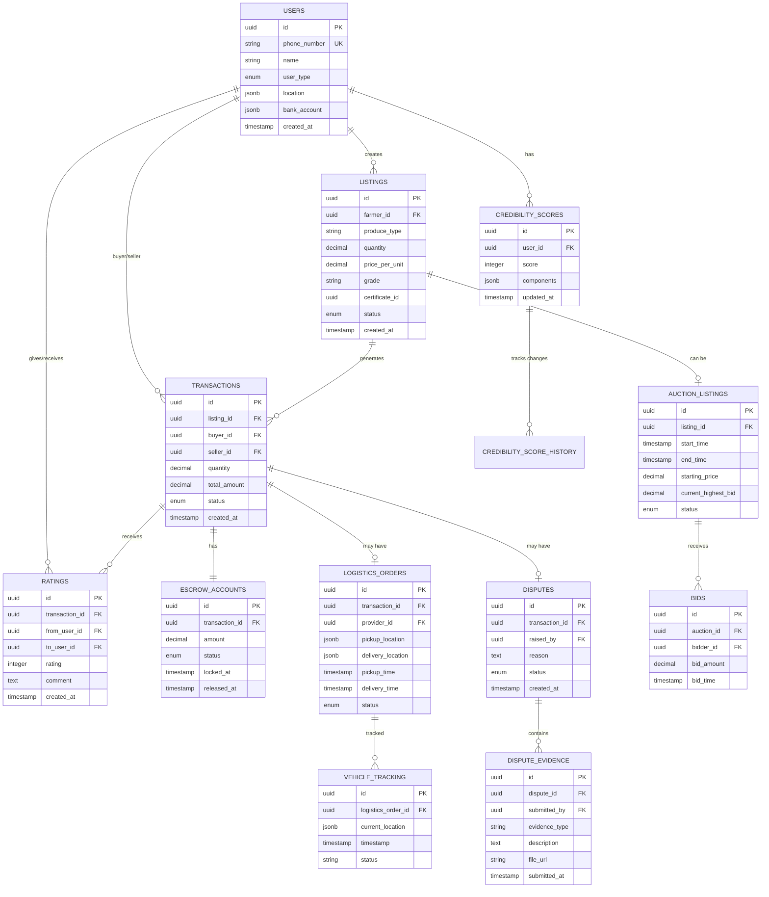

#### MongoDB - Document Database
**Purpose**: Flexible schema storage for unstructured/semi-structured data
**Collections**: 10 collections
**Key Features**:
- Flexible schemas for evolving data structures
- Compound indexes for efficient queries
- Document size limit: 16MB
- Connection pooling (min 5, max 10)
- Aggregation pipeline for complex queries

**Collections**:
1. **photo_logs** - Farming activity photos with GPS metadata
2. **quality_certificates** - AI-generated quality certificates
3. **price_predictions** - 7-day price forecasts
4. **voice_queries** - Voice assistant query history
5. **feedback_comments** - Detailed user feedback
6. **disease_diagnoses** - Crop disease diagnoses with treatments
7. **soil_test_reports** - Soil health test results
8. **smart_alerts** - Weather, pest, price alerts
9. **traceability_records** - End-to-end produce traceability
10. **ad_listings** - Voice-to-ad generated listings

#### SQLite - Offline Storage
**Purpose**: Local device storage for offline functionality
**Tables**: 10 tables
**Key Features**:
- WAL mode for better concurrency
- File-level encryption (SQLCipher in production)
- Automatic sync when connectivity restored
- FIFO sync queue processing

**Tables**:
1. **cached_listings** - Cached marketplace listings
2. **pending_sync_queue** - Operations waiting to sync
3. **local_photo_logs** - Photos stored locally
4. **user_profile** - Cached user profile
5. **ai_models_metadata** - Local AI model metadata
6. **cached_certificates** - Quality certificates cache
7. **offline_activities** - Activity log
8. **cached_transactions** - Transaction history cache
9. **sync_status** - Sync status per entity type
10. **app_settings** - Application settings

**Sync Strategy**:
```
1. User performs action offline
2. Save to SQLite immediately
3. Add to pending_sync_queue
4. When online, process queue (FIFO)
5. Sync to PostgreSQL/MongoDB
6. Mark as synced, remove from queue
7. Handle conflicts (server wins for transactions)
```

#### Data Consistency Rules

**Transaction States**:
```
PENDING → ACCEPTED → PAYMENT_LOCKED → IN_TRANSIT → DELIVERED → COMPLETED
                                                              ↓
                                                          DISPUTED
```

**Escrow Rules**:
- Funds locked when transaction status = PAYMENT_LOCKED
- Funds released when status = COMPLETED (quality match >90%)
- Funds frozen when status = DISPUTED

**Credibility Score**:
- Range: 300-900
- Components: transaction_history (35%), payment_reliability (30%), farming_consistency (20%), produce_quality (15%)
- Updated on transaction completion
- History tracked with audit trail

**Rating System**:
- Range: 0-5
- Implicit rating (70%) + Explicit rating (30%)
- Both parties can rate after completion

#### Database Documentation

Complete database documentation available in:
- `DATABASE-DOCUMENTATION.md` - Complete table documentation
- `DATABASE-ER-DIAGRAMS.md` - Visual relationship diagrams
- `DATABASE-SUMMARY.md` - Quick reference guide
- `src/database/README.md` - PostgreSQL specific docs
- `src/database/MONGODB-README.md` - MongoDB specific docs
- `src/database/SQLITE-README.md` - SQLite specific docs

## Process Flow Diagrams

### 1. Farmer Onboarding and Produce Listing Flow


### 2. Buyer Purchase and Smart Escrow Flow


### 3. Delivery Validation and Fund Release Flow


### 4. Photo-Log and Credibility Score Building Flow


### 5. Offline-to-Online Sync Flow


### 6. Dispute Resolution Flow


### 7. Kisan-Mitra Voice Assistant Flow


### 8. Complete Transaction Lifecycle


### 9. Auction and Bidding Flow

```mermaid
sequenceDiagram
    participant F as Farmer
    participant App as Mobile App
    participant BE as Backend
    participant B1 as Buyer 1
    participant B2 as Buyer 2
    participant Bn as Buyer N

    F->>App: Create Auction Listing
    App->>App: Attach Quality Certificate
    F->>App: Set Reserve Price & Duration
    App->>BE: Publish Auction
    BE->>BE: Validate Certificate
    BE->>B1: Notify: New Auction
    BE->>B2: Notify: New Auction
    BE->>Bn: Notify: New Auction
    
    B1->>BE: Place Bid (₹X)
    BE->>F: Notify: New Bid
    BE->>B2: Notify: Bid Update
    BE->>Bn: Notify: Bid Update
    
    B2->>BE: Place Higher Bid (₹X+Y)
    BE->>F: Notify: Higher Bid
    BE->>B1: Notify: Outbid
    BE->>Bn: Notify: Bid Update
    
    loop Until Auction Ends
        Bn->>BE: Place Bid
        BE->>F: Notify: Bid Update
        BE->>B1: Notify: Bid Update
        BE->>B2: Notify: Bid Update
    end
    
    BE->>BE: Auction Timer Expires
    BE->>BE: Determine Winner
    
    alt Winning Bid >= Reserve Price
        BE->>B2: You Won! Create Escrow
        BE->>F: Auction Successful
        BE->>B1: Auction Ended
        BE->>Bn: Auction Ended
        B2->>BE: Deposit Funds to Escrow
        BE->>F: Payment Locked, Ship Produce
    else No Bids or Below Reserve
        BE->>F: Auction Failed
        BE->>B1: Auction Ended (No Winner)
        BE->>B2: Auction Ended (No Winner)
    end
```

### 10. Disease and Pest Diagnosis Flow

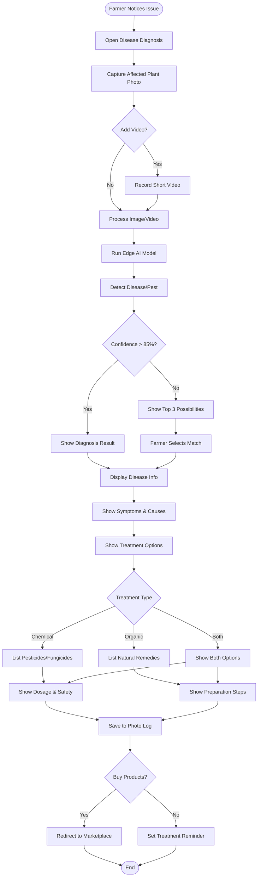

### 11. Crop-AI Advisor Flow

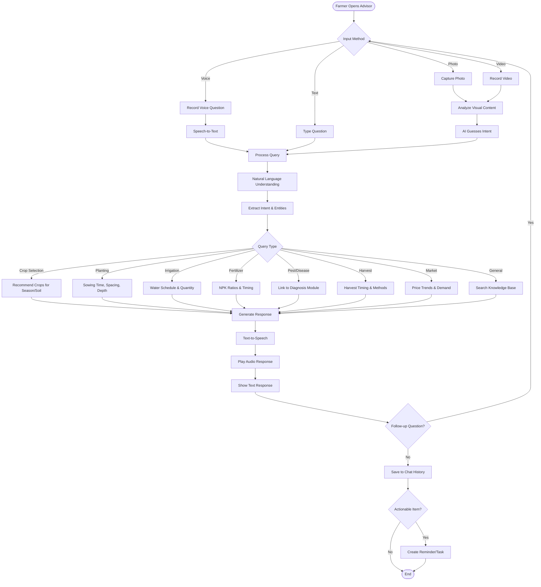

### 12. Soil Health Recording Flow

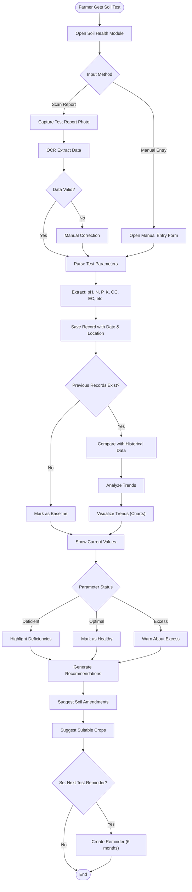

### 13. Smart Alerts and Predictive Advisory Flow

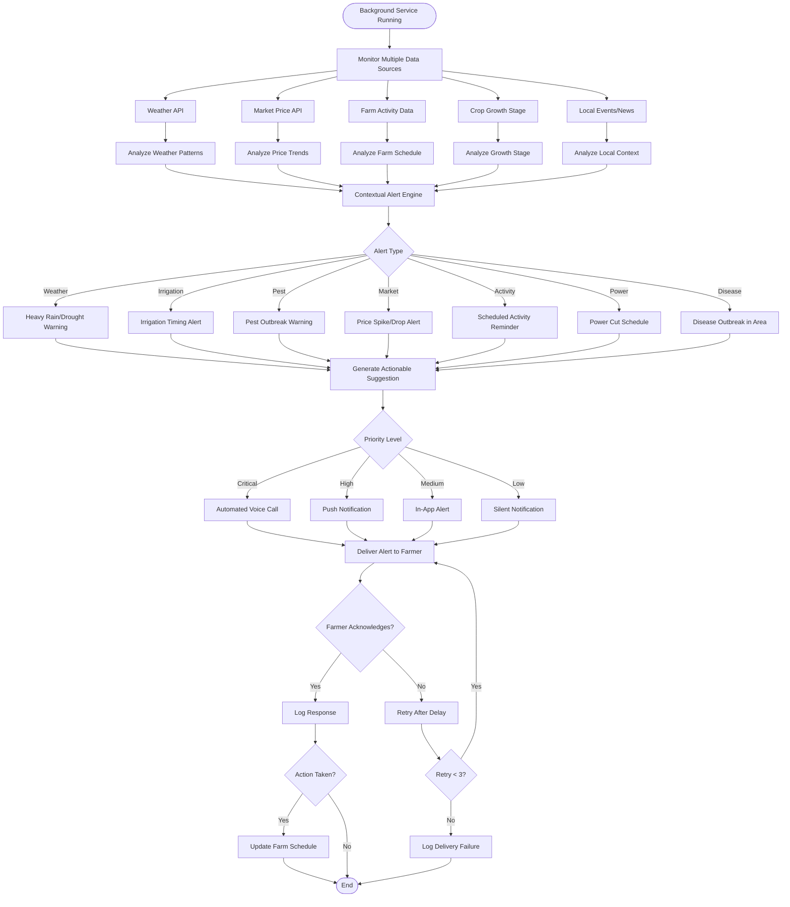

### 14. Manure and Compost Marketplace Flow

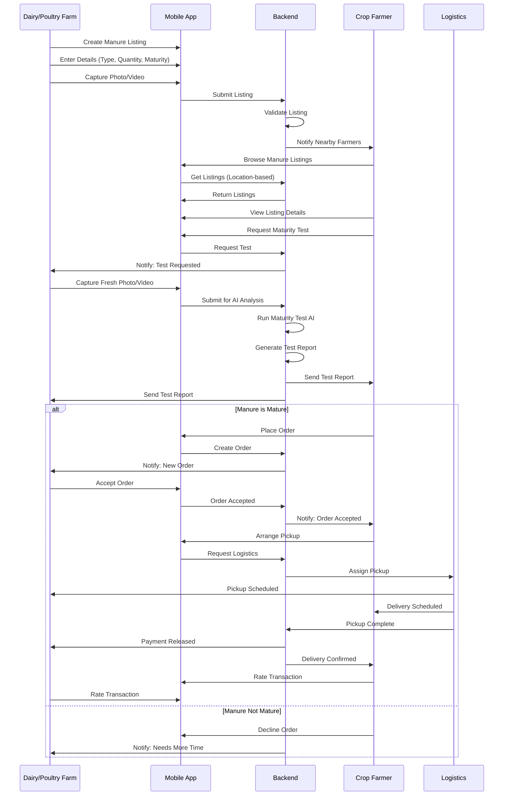

### 15. Manure Maturity Test Flow

```mermaid
flowchart TD
    Start([Farmer Requests Test]) --> CaptureMedia[Capture Photo/Video of Manure]
    CaptureMedia --> UploadMedia[Upload to Backend]
    
    UploadMedia --> EdgeAI{Edge AI Available?}
    
    EdgeAI -->|Yes| LocalAnalysis[Run Local AI Model]
    EdgeAI -->|No| CloudAnalysis[Send to Cloud AI]
    
    LocalAnalysis --> AnalyzeVisual[Analyze Visual Features]
    CloudAnalysis --> AnalyzeVisual
    
    AnalyzeVisual --> CheckColor["Check Color (Dark Brown/Black)"]
    AnalyzeVisual --> CheckTexture["Check Texture (Crumbly)"]
    AnalyzeVisual --> CheckMoisture[Check Moisture Level]
    AnalyzeVisual --> CheckOdor["Estimate Odor (from visual cues)"]
    
    CheckColor --> ScoreColor["Color Score: 0-100"]
    CheckTexture --> ScoreTexture["Texture Score: 0-100"]
    CheckMoisture --> ScoreMoisture["Moisture Score: 0-100"]
    CheckOdor --> ScoreOdor["Odor Score: 0-100"]
    
    ScoreColor --> CalculateOverall[Calculate Overall Maturity Score]
    ScoreTexture --> CalculateOverall
    ScoreMoisture --> CalculateOverall
    ScoreOdor --> CalculateOverall
    
    CalculateOverall --> MaturityLevel{Maturity Score}
    
    MaturityLevel -->|>85| FullyMature[Fully Mature ✓]
    MaturityLevel -->|60-85| PartiallyMature[Partially Mature ⚠]
    MaturityLevel -->|<60| NotMature[Not Mature ✗]
    
    FullyMature --> SafeToUse[Safe to Use Immediately]
    PartiallyMature --> WaitTime[Wait 2-4 Weeks]
    NotMature --> WaitLonger[Wait 4-8 Weeks]
    
    SafeToUse --> GenerateReport[Generate Test Report]
    WaitTime --> GenerateReport
    WaitLonger --> GenerateReport
    
    GenerateReport --> ShowResults[Show Results to Farmer]
    ShowResults --> Recommendations[Show Usage Recommendations]
    
    Recommendations --> SaveReport[Save Report to History]
    SaveReport --> ShareOption{Share Report?}
    
    ShareOption -->|Yes| ShareBuyer[Share with Potential Buyers]
    ShareOption -->|No| End([End])
    
    ShareBuyer --> End
```

### 16. Voice-to-Ad Generation Flow

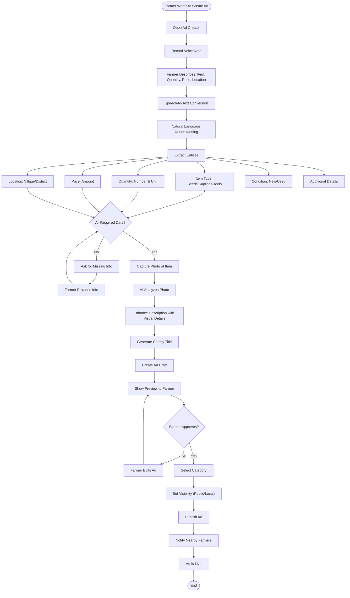

### 17. Government Scheme Eligibility Flow

```mermaid
flowchart TD
    Start([Farmer Opens Schemes]) --> LoadProfile[Load Farmer Profile]
    LoadProfile --> FetchSchemes[Fetch Active Government Schemes]
    
    FetchSchemes --> SchemeDB[Government Schemes Database]
    SchemeDB --> FilterByState[Filter by State]
    FilterByState --> FilterByDistrict[Filter by District]
    
    FilterByDistrict --> MatchEngine[AI Matching Engine]
    
    MatchEngine --> CheckLandSize[Check Land Size]
    MatchEngine --> CheckCropType[Check Crop Type]
    MatchEngine --> CheckIncome[Check Income Level]
    MatchEngine --> CheckAge[Check Farmer Age]
    MatchEngine --> CheckGender["Check Gender (Women schemes)"]
    MatchEngine --> CheckCaste["Check Category (SC/ST/OBC)"]
    MatchEngine --> CheckBankAccount[Check Bank Account]
    MatchEngine --> CheckPrevSchemes[Check Previous Schemes]
    
    CheckLandSize --> CalculateMatch[Calculate Match Score]
    CheckCropType --> CalculateMatch
    CheckIncome --> CalculateMatch
    CheckAge --> CalculateMatch
    CheckGender --> CalculateMatch
    CheckCaste --> CalculateMatch
    CheckBankAccount --> CalculateMatch
    CheckPrevSchemes --> CalculateMatch
    
    CalculateMatch --> RankSchemes[Rank Schemes by Eligibility]
    RankSchemes --> DisplayResults[Display Results]
    
    DisplayResults --> SchemeCategories{Scheme Category}
    
    SchemeCategories -->|Subsidy| SubsidySchemes[Fertilizer/Seed Subsidy]
    SchemeCategories -->|Insurance| InsuranceSchemes[Crop Insurance]
    SchemeCategories -->|Loan| LoanSchemes[Kisan Credit Card]
    SchemeCategories -->|Equipment| EquipmentSchemes[Machinery Subsidy]
    SchemeCategories -->|Training| TrainingSchemes[Skill Development]
    
    SubsidySchemes --> ShowDetails[Show Scheme Details]
    InsuranceSchemes --> ShowDetails
    LoanSchemes --> ShowDetails
    EquipmentSchemes --> ShowDetails
    TrainingSchemes --> ShowDetails
    
    ShowDetails --> EligibilityStatus{Eligibility Status}
    
    EligibilityStatus -->|Eligible| ShowApply[Show Apply Button]
    EligibilityStatus -->|Partially| ShowMissing[Show Missing Requirements]
    EligibilityStatus -->|Not Eligible| ShowReason[Show Reason]
    
    ShowApply --> ApplyNow{Apply Now?}
    ShowMissing --> CompleteProfile[Complete Profile]
    ShowReason --> ExploreOthers[Explore Other Schemes]
    
    CompleteProfile --> ShowApply
    ExploreOthers --> DisplayResults
    
    ApplyNow -->|Yes| CollectDocs[Collect Required Documents]
    ApplyNow -->|No| SaveForLater[Save for Later]
    
    CollectDocs --> UploadDocs[Upload Documents]
    UploadDocs --> SubmitApplication[Submit Application]
    
    SubmitApplication --> TrackApplication[Track Application Status]
    SaveForLater --> End([End])
    TrackApplication --> End
```

### 18. Logistics Route Optimization Flow

```mermaid
flowchart TD
    Start([Multiple Pickup Requests]) --> CollectRequests[Collect Pickup Requests]
    CollectRequests --> ExtractLocations[Extract Pickup Locations]
    
    ExtractLocations --> CheckProximity{Locations Within 50km?}
    
    CheckProximity -->|No| IndividualRoutes[Create Individual Routes]
    CheckProximity -->|Yes| PoolingOpportunity[Pooling Opportunity Detected]
    
    PoolingOpportunity --> NotifyFarmers["Notify Farmers: Pooling Available"]
    NotifyFarmers --> FarmersAgree{All Farmers Agree?}
    
    FarmersAgree -->|No| IndividualRoutes
    FarmersAgree -->|Yes| OptimizeRoute[Run Route Optimization]
    
    OptimizeRoute --> TSPAlgorithm[Traveling Salesman Algorithm]
    TSPAlgorithm --> ConsiderFactors[Consider Factors]
    
    ConsiderFactors --> RoadConditions[Road Conditions]
    ConsiderFactors --> TrafficData[Traffic Data]
    ConsiderFactors --> ProduceType["Produce Type (Perishability)"]
    ConsiderFactors --> TruckCapacity[Truck Capacity]
    ConsiderFactors --> TimeWindows[Pickup Time Windows]
    
    RoadConditions --> GenerateRoute[Generate Optimal Route]
    TrafficData --> GenerateRoute
    ProduceType --> GenerateRoute
    TruckCapacity --> GenerateRoute
    TimeWindows --> GenerateRoute
    
    GenerateRoute --> CalculateSavings[Calculate Cost Savings]
    CalculateSavings --> SplitCosts[Split Costs Among Farmers]
    
    SplitCosts --> ShowRoute[Show Route to All Parties]
    IndividualRoutes --> ShowRoute
    
    ShowRoute --> AssignVehicle[Assign Vehicle]
    AssignVehicle --> NotifyDriver[Notify Driver]
    
    NotifyDriver --> ShareETA[Share ETA with Farmers]
    ShareETA --> StartPickup[Start Pickup Route]
    
    StartPickup --> PickupLoop{More Pickups?}
    
    PickupLoop -->|Yes| NextLocation[Navigate to Next Location]
    NextLocation --> ArriveLocation[Arrive at Location]
    ArriveLocation --> LoadProduce[Load Produce]
    LoadProduce --> UpdateStatus[Update Status]
    UpdateStatus --> PickupLoop
    
    PickupLoop -->|No| AllLoaded[All Produce Loaded]
    AllLoaded --> OptimizeDelivery[Optimize Delivery Route]
    
    OptimizeDelivery --> DeliverProduce[Deliver to Buyers]
    DeliverProduce --> End([End])
```

### 19. Live Vehicle Tracking Flow

```mermaid
sequenceDiagram
    participant F as Farmer
    participant App as Mobile App
    participant BE as Backend
    participant GPS as GPS Tracker
    participant D as Driver
    participant B as Buyer

    F->>App: View Order Status
    App->>BE: Get Order Details
    BE->>App: Order in Transit
    App->>F: Show "Track Vehicle" Button
    
    F->>App: Click Track Vehicle
    App->>BE: Request Live Location
    BE->>GPS: Get Current Location
    GPS->>BE: GPS Coordinates
    BE->>App: Location Data
    App->>F: Show on Map
    
    loop Every 30 seconds
        GPS->>BE: Update Location
        BE->>App: Push Location Update
        App->>F: Update Map
    end
    
    BE->>BE: Calculate ETA
    BE->>App: Send ETA
    App->>F: Show ETA
    
    alt Delay Detected
        BE->>BE: Detect Route Deviation/Delay
        BE->>F: Send Delay Alert
        BE->>B: Send Delay Alert
        BE->>D: Request Status Update
        D->>BE: Provide Reason
        BE->>F: Share Reason
        BE->>B: Share Reason
    end
    
    GPS->>BE: Approaching Destination
    BE->>B: Notify: Vehicle Arriving Soon
    BE->>F: Notify: Delivery Imminent
    
    D->>BE: Delivery Complete
    BE->>B: Request Delivery Confirmation
    B->>BE: Confirm Delivery
    BE->>F: Notify: Delivery Confirmed
```

### 20. End-to-End Traceability Flow

```mermaid
flowchart TD
    Start([Seed Purchase]) --> RecordSeed[Record Seed Details]
    RecordSeed --> SeedBatch[Batch Number, Supplier, Date]
    SeedBatch --> CreateTraceID[Create Traceability ID]
    
    CreateTraceID --> Sowing[Sowing Activity]
    Sowing --> PhotoLog1["Photo Log: Sowing"]
    PhotoLog1 --> RecordDate1["Record Date & Location"]
    
    RecordDate1 --> GrowthStage[Growth Monitoring]
    GrowthStage --> PhotoLog2["Photo Log: Growth Stages"]
    PhotoLog2 --> RecordActivities[Record Activities]
    
    RecordActivities --> Irrigation[Irrigation Events]
    RecordActivities --> Fertilization[Fertilization Events]
    RecordActivities --> PestControl[Pest Control Events]
    RecordActivities --> Weeding[Weeding Events]
    
    Irrigation --> LogInputs[Log Inputs Used]
    Fertilization --> LogInputs
    PestControl --> LogInputs
    Weeding --> LogInputs
    
    LogInputs --> InputDetails[Product Name, Quantity, Date]
    InputDetails --> Harvest[Harvest Activity]
    
    Harvest --> PhotoLog3["Photo Log: Harvest"]
    PhotoLog3 --> RecordYield[Record Yield]
    RecordYield --> QualityGrading[Fasal-Parakh Grading]
    
    QualityGrading --> Certificate[Quality Certificate]
    Certificate --> LinkTrace[Link to Trace ID]
    
    LinkTrace --> Packaging[Packaging]
    Packaging --> PackageID[Generate Package ID]
    PackageID --> LinkPackage[Link Package to Trace ID]
    
    LinkPackage --> Dispatch[Dispatch to Buyer]
    Dispatch --> LogisticInfo[Logistics Information]
    LogisticInfo --> VehicleID[Vehicle ID, Driver, Route]
    
    VehicleID --> Transit[In Transit]
    Transit --> LiveTracking[Live GPS Tracking]
    LiveTracking --> Delivery[Delivery]
    
    Delivery --> BuyerVerification[Buyer Verification]
    BuyerVerification --> DeliveryPhoto[Delivery Photo]
    DeliveryPhoto --> QualityCheck[Quality Check]
    
    QualityCheck --> FinalRecord[Final Record]
    FinalRecord --> CompleteTrace[Complete Traceability Chain]
    
    CompleteTrace --> GenerateQR[Generate QR Code]
    GenerateQR --> QRContains[QR Contains Full Journey]
    
    QRContains --> SeedToShelf[Seed → Sowing → Growth → Harvest → Grade → Delivery]
    SeedToShelf --> ConsumerScan[Consumer Can Scan QR]
    
    ConsumerScan --> ViewJourney[View Complete Journey]
    ViewJourney --> VerifyAuthenticity[Verify Authenticity]
    VerifyAuthenticity --> End([End])
```

## UI Wireframes and Screen Mockups

### Design Principles for UI

- **Simplicity First**: Clean, uncluttered interfaces with clear call-to-action buttons
- **Vernacular Support**: All text in user's preferred language with culturally appropriate icons
- **Offline Indicators**: Clear visual feedback when offline mode is active
- **Touch-Friendly**: Minimum 44x44pt touch targets for easy interaction
- **High Contrast**: Readable in bright sunlight (common in farming environments)
- **Progressive Disclosure**: Show essential information first, details on demand

### 1. Onboarding Screens

#### 1.1 Language Selection Screen

```mermaid
graph TD
    subgraph "Language Selection"
        A["<div style='text-align:center'>
        <b>Bharat Mandi</b><br/>
        🌾<br/><br/>
        <b>Select Your Language</b><br/>
        अपनी भाषा चुनें<br/><br/>
        [हिंदी] [English]<br/>
        [தமிழ்] [తెలుగు]<br/>
        [मराठी] [বাংলা]<br/>
        [ગુજરાતી] [ಕನ್ನಡ]<br/><br/>
        [Continue →]
        </div>"]
    end
```

#### 1.2 Registration Screen

```mermaid
graph TD
    subgraph "Registration"
        B["<div style='text-align:center'>
        ← Back | <b>Register</b><br/><br/>
        I am a:<br/>
        ○ Farmer  ○ Buyer<br/><br/>
        📱 Mobile Number<br/>
        [+91 __________]<br/><br/>
        👤 Full Name<br/>
        [____________]<br/><br/>
        📍 Location<br/>
        [City, State]<br/><br/>
        🏦 Bank Account<br/>
        [Account Number]<br/>
        [IFSC Code]<br/><br/>
        [Send OTP]
        </div>"]
    end
```

#### 1.3 OTP Verification Screen

```mermaid
graph TD
    subgraph "OTP Verification"
        C["<div style='text-align:center'>
        ← Back | <b>Verify OTP</b><br/><br/>
        Enter the 6-digit code sent to<br/>
        +91 98765-43210<br/><br/>
        [_] [_] [_] [_] [_] [_]<br/><br/>
        Didn't receive code?<br/>
        <u>Resend OTP</u> (0:45)<br/><br/>
        [Verify & Continue]
        </div>"]
    end
```

### 2. Farmer Dashboard

```mermaid
graph TD
    subgraph "Farmer Home Screen"
        D["<div style='text-align:left'>
        <b>Namaste, राजेश! 🙏</b><br/>
        Credibility Score: ⭐ 750/900<br/><br/>
        [🔔 3] [⚙️ Settings]<br/><br/>
        ┌─────────────────────┐<br/>
        │ 📸 Grade Produce    │<br/>
        │ Get AI Quality Cert │<br/>
        └─────────────────────┘<br/><br/>
        ┌─────────────────────┐<br/>
        │ 📋 My Listings (5)  │<br/>
        │ Active: 3 | Sold: 2 │<br/>
        └─────────────────────┘<br/><br/>
        ┌─────────────────────┐<br/>
        │ 📷 Photo-Log        │<br/>
        │ 47 Activities       │<br/>
        └─────────────────────┘<br/><br/>
        ┌─────────────────────┐<br/>
        │ 💰 Transactions     │<br/>
        │ Pending: ₹45,000    │<br/>
        └─────────────────────┘<br/><br/>
        🎤 Kisan-Mitra | 📊 Analytics
        </div>"]
    end
```

### 3. Fasal-Parakh (Grading) Screens

#### 3.1 Camera Screen

```mermaid
graph TD
    subgraph "Capture Produce Photo"
        E["<div style='text-align:center'>
        ← Back | <b>Grade Produce</b><br/><br/>
        ┌─────────────────────┐<br/>
        │                     │<br/>
        │   📷 CAMERA VIEW    │<br/>
        │                     │<br/>
        │   [Tomatoes in      │<br/>
        │    viewfinder]      │<br/>
        │                     │<br/>
        └─────────────────────┘<br/><br/>
        Tips:<br/>
        • Good lighting<br/>
        • Clear view of produce<br/>
        • Fill the frame<br/><br/>
        [⚪ Capture]<br/>
        [🔦] [🔄] [📁 Gallery]
        </div>"]
    end
```

#### 3.2 Analysis Progress Screen

```mermaid
graph TD
    subgraph "Analyzing..."
        F["<div style='text-align:center'>
        <b>Analyzing Your Produce</b><br/><br/>
        ┌─────────────────────┐<br/>
        │   [Tomato Image]    │<br/>
        └─────────────────────┘<br/><br/>
        ⏳ AI Analysis in Progress...<br/><br/>
        ✓ Size Analysis<br/>
        ✓ Color Check<br/>
        ⏺ Defect Detection<br/>
        ⏺ Quality Grading<br/><br/>
        [████████░░] 80%<br/><br/>
        ⚡ Working Offline
        </div>"]
    end
```

#### 3.3 Grading Results Screen

```mermaid
graph TD
    subgraph "Quality Certificate"
        G["<div style='text-align:center'>
        <b>Quality Certificate</b><br/><br/>
        ┌─────────────────────┐<br/>
        │   [Tomato Image]    │<br/>
        └─────────────────────┘<br/><br/>
        <b style='font-size:24px'>Grade: A</b> 🏆<br/>
        Confidence: 94%<br/><br/>
        📏 Size: Uniform (92%)<br/>
        🎨 Color: Excellent<br/>
        ⚠️ Defects: <5%<br/><br/>
        📍 Location: Verified<br/>
        🕐 Time: 14:30, 15 Feb 2026<br/><br/>
        Cert ID: #BM-2026-00123<br/><br/>
        [Create Listing] [Re-Grade]
        </div>"]
    end
```

### 4. Marketplace Screens

#### 4.1 Create Listing Screen

```mermaid
graph TD
    subgraph "Create Listing"
        H["<div style='text-align:left'>
        ← Back | <b>Create Listing</b><br/><br/>
        ✓ Quality Certificate<br/>
        Grade A | Cert #BM-00123<br/><br/>
        🌾 Produce Type<br/>
        [Tomato ▼]<br/><br/>
        ⚖️ Quantity<br/>
        [____] [Quintal ▼]<br/><br/>
        💰 Price per Quintal<br/>
        [₹ ____]<br/><br/>
        📅 Expected Harvest<br/>
        [20 Feb 2026 📅]<br/><br/>
        📍 Pickup Location<br/>
        [Nashik, Maharashtra]<br/><br/>
        📝 Additional Notes<br/>
        [Optional details...]<br/><br/>
        [Publish Listing]
        </div>"]
    end
```

#### 4.2 Marketplace Search Screen

```mermaid
graph TD
    subgraph "Digital Mandi"
        I["<div style='text-align:left'>
        <b>Digital Mandi</b> [🔔] [⚙️]<br/><br/>
        [🔍 Search produce...]<br/><br/>
        Filters: [All ▼] [Grade ▼] [📍]<br/><br/>
        ┌─────────────────────┐<br/>
        │ 🍅 Tomato - Grade A │<br/>
        │ 50 Quintal | ₹2,500 │<br/>
        │ ⭐ 4.8 | राजेश पाटील│<br/>
        │ 📍 Nashik (45 km)   │<br/>
        │ [View Details →]    │<br/>
        └─────────────────────┘<br/><br/>
        ┌─────────────────────┐<br/>
        │ 🥔 Potato - Grade B │<br/>
        │ 100 Quintal | ₹1,800│<br/>
        │ ⭐ 4.5 | सुरेश कुमार│<br/>
        │ 📍 Pune (120 km)    │<br/>
        │ [View Details →]    │<br/>
        └─────────────────────┘
        </div>"]
    end
```

#### 4.3 Listing Detail Screen

```mermaid
graph TD
    subgraph "Listing Details"
        J["<div style='text-align:left'>
        ← Back | <b>Listing Details</b> [❤️]<br/><br/>
        ┌─────────────────────┐<br/>
        │   [Tomato Images]   │<br/>
        │   ◉ ○ ○ ○          │<br/>
        └─────────────────────┘<br/><br/>
        <b>Fresh Tomatoes - Grade A</b><br/>
        ⭐ 4.8 (127 reviews)<br/><br/>
        💰 ₹2,500 per Quintal<br/>
        ⚖️ 50 Quintal Available<br/>
        📅 Harvest: 20 Feb 2026<br/><br/>
        👨‍🌾 <b>राजेश पाटील</b><br/>
        Credibility: 780/900<br/>
        📍 Nashik, Maharashtra<br/><br/>
        📜 <b>Quality Certificate</b><br/>
        Grade A | 94% Confidence<br/>
        Cert #BM-2026-00123<br/>
        [View Certificate]<br/><br/>
        [Place Order] [Contact Seller]
        </div>"]
    end
```

### 5. Transaction Screens

#### 5.1 Order Confirmation Screen

```mermaid
graph TD
    subgraph "Confirm Order"
        K["<div style='text-align:left'>
        ← Back | <b>Confirm Order</b><br/><br/>
        <b>Order Summary</b><br/><br/>
        Tomato - Grade A<br/>
        Quantity: 10 Quintal<br/>
        Price: ₹2,500/Quintal<br/><br/>
        Subtotal: ₹25,000<br/>
        Logistics: ₹2,000<br/>
        ─────────────────<br/>
        <b>Total: ₹27,000</b><br/><br/>
        📍 Delivery Address<br/>
        [Mumbai, Maharashtra]<br/><br/>
        🚚 Logistics Partner<br/>
        [Select Provider ▼]<br/><br/>
        ✓ I agree to terms<br/><br/>
        [Confirm & Pay]
        </div>"]
    end
```

#### 5.2 Escrow Payment Screen

```mermaid
graph TD
    subgraph "Secure Payment"
        L["<div style='text-align:center'>
        <b>Secure Escrow Payment</b><br/><br/>
        Amount: ₹27,000<br/><br/>
        🔒 Your payment is protected<br/><br/>
        How it works:<br/>
        1. Pay now to secure escrow<br/>
        2. Farmer dispatches produce<br/>
        3. You receive & verify<br/>
        4. Payment auto-released<br/><br/>
        Select Payment Method:<br/><br/>
        ○ UPI<br/>
        ○ Net Banking<br/>
        ○ Debit/Credit Card<br/><br/>
        [Proceed to Pay]<br/><br/>
        🛡️ 100% Secure & Encrypted
        </div>"]
    end
```

#### 5.3 Transaction Tracking Screen

```mermaid
graph TD
    subgraph "Track Order"
        M["<div style='text-align:left'>
        ← Back | <b>Order #BM-TX-456</b><br/><br/>
        <b>Tomato - Grade A</b><br/>
        10 Quintal | ₹27,000<br/><br/>
        <b>Status: In Transit 🚚</b><br/><br/>
        Timeline:<br/>
        ✓ Order Placed<br/>
        │ 15 Feb, 10:30 AM<br/>
        │<br/>
        ✓ Payment Secured<br/>
        │ 15 Feb, 10:35 AM<br/>
        │<br/>
        ✓ Dispatched<br/>
        │ 16 Feb, 6:00 AM<br/>
        │<br/>
        ⏺ In Transit<br/>
        │ Expected: 17 Feb<br/>
        │<br/>
        ○ Delivered<br/><br/>
        👨‍🌾 Seller: राजेश पाटील<br/>
        📞 [Contact] [Track Live]<br/><br/>
        [Need Help?]
        </div>"]
    end
```

### 6. Photo-Log Screens

#### 6.1 Photo-Log Timeline

```mermaid
graph TD
    subgraph "Photo-Log"
        N["<div style='text-align:left'>
        ← Back | <b>My Photo-Log</b> [+]<br/><br/>
        Filter: [All ▼] [This Month ▼]<br/><br/>
        <b>February 2026</b><br/><br/>
        15 Feb • Spraying<br/>
        ┌──────────────┐<br/>
        │ [Photo]      │<br/>
        └──────────────┘<br/>
        Pesticide application<br/>
        📍 Farm Plot A<br/><br/>
        10 Feb • Fertigation<br/>
        ┌──────────────┐<br/>
        │ [Photo]      │<br/>
        └──────────────┘<br/>
        Drip irrigation setup<br/>
        📍 Farm Plot B<br/><br/>
        5 Feb • Sowing<br/>
        ┌──────────────┐<br/>
        │ [Photo]      │<br/>
        └──────────────┘<br/>
        Tomato seedlings<br/>
        📍 Farm Plot A<br/><br/>
        [Export for Loan] [Analytics]
        </div>"]
    end
```

#### 6.2 Add Photo-Log Entry

```mermaid
graph TD
    subgraph "Add Activity"
        O["<div style='text-align:center'>
        ← Back | <b>Log Activity</b><br/><br/>
        ┌─────────────────────┐<br/>
        │   📷 CAMERA VIEW    │<br/>
        │   [Activity Photo]  │<br/>
        └─────────────────────┘<br/><br/>
        Activity Type:<br/>
        ○ Tilling<br/>
        ○ Sowing<br/>
        ● Spraying<br/>
        ○ Fertigation<br/>
        ○ Harvest<br/><br/>
        📝 Notes (Optional)<br/>
        [Add details...]<br/><br/>
        📍 Location: Auto-detected<br/>
        🕐 Time: Auto-captured<br/><br/>
        [Save Activity]
        </div>"]
    end
```

### 7. Credibility Score Screen

```mermaid
graph TD
    subgraph "Credibility Score"
        P["<div style='text-align:left'>
        ← Back | <b>My Credibility Score</b><br/><br/>
        ┌─────────────────────┐<br/>
        │   <b>750 / 900</b>      │<br/>
        │   ⭐⭐⭐⭐☆         │<br/>
        │   <b>GOOD</b>           │<br/>
        │   ↗️ Improving       │<br/>
        └─────────────────────┘<br/><br/>
        <b>Score Breakdown:</b><br/><br/>
        Transaction History 35%<br/>
        [████████░░] 280/315<br/><br/>
        Payment Reliability 30%<br/>
        [█████████░] 245/270<br/><br/>
        Farming Consistency 20%<br/>
        [███████░░░] 140/180<br/><br/>
        Produce Quality 15%<br/>
        [████████░░] 85/135<br/><br/>
        <b>Benefits:</b><br/>
        ✓ Priority in search<br/>
        ✓ Lower transaction fees<br/>
        ✓ Loan eligibility<br/><br/>
        [Share with Bank] [History]
        </div>"]
    end
```

### 8. Kisan-Mitra Voice Assistant

```mermaid
graph TD
    subgraph "Kisan-Mitra"
        Q["<div style='text-align:center'>
        ← Back | <b>Kisan-Mitra</b> 🎤<br/><br/>
        <b>Your AI Assistant</b><br/><br/>
        ┌─────────────────────┐<br/>
        │                     │<br/>
        │   🎤 Listening...   │<br/>
        │                     │<br/>
        │   [Sound Waves]     │<br/>
        │                     │<br/>
        └─────────────────────┘<br/><br/>
        Ask me about:<br/>
        • Market prices<br/>
        • Weather forecast<br/>
        • Farming tips<br/>
        • Platform help<br/><br/>
        Recent Queries:<br/>
        • Tomato price today?<br/>
        • When to harvest wheat?<br/><br/>
        [🎤 Hold to Speak]
        </div>"]
    end
```

### 9. Price Prophecy Screen

```mermaid
graph TD
    subgraph "Price Predictions"
        R["<div style='text-align:left'>
        ← Back | <b>Price Prophecy</b> 📈<br/><br/>
        Produce: [Tomato ▼]<br/>
        Market: [Nashik ▼]<br/><br/>
        <b>7-Day Forecast</b><br/><br/>
        ┌─────────────────────┐<br/>
        │     [Line Chart]    │<br/>
        │   ₹2,800            │<br/>
        │   ₹2,600            │<br/>
        │   ₹2,400 ←Current   │<br/>
        │   ₹2,200            │<br/>
        │   ₹2,000            │<br/>
        │   ─────────────     │<br/>
        │   16 17 18 19 20 21 │<br/>
        └─────────────────────┘<br/><br/>
        <b>Recommendation: WAIT</b> ⏳<br/>
        Prices expected to rise<br/>
        by 8% in 3 days<br/><br/>
        Confidence: 87%<br/><br/>
        [Set Price Alert] [Compare Markets]
        </div>"]
    end
```

### 10. Notifications Screen

```mermaid
graph TD
    subgraph "Notifications"
        S["<div style='text-align:left'>
        ← Back | <b>Notifications</b><br/><br/>
        Today<br/><br/>
        🔔 <b>New Order Received!</b><br/>
        Buyer wants 10 Quintal Tomato<br/>
        [View Order] • 2 min ago<br/><br/>
        💰 <b>Payment Released</b><br/>
        ₹27,000 credited to account<br/>
        [View Details] • 1 hour ago<br/><br/>
        Yesterday<br/><br/>
        📈 <b>Price Alert</b><br/>
        Tomato prices up by 5%<br/>
        [Check Prices] • Yesterday<br/><br/>
        ⭐ <b>Score Improved!</b><br/>
        Your credibility: 750/900<br/>
        [View Score] • Yesterday<br/><br/>
        [Mark All as Read]
        </div>"]
    end
```

### 11. Settings Screen

```mermaid
graph TD
    subgraph "Settings"
        T["<div style='text-align:left'>
        ← Back | <b>Settings</b><br/><br/>
        <b>Account</b><br/>
        👤 Profile<br/>
        🔐 Security & Privacy<br/>
        🏦 Bank Details<br/><br/>
        <b>Preferences</b><br/>
        🌐 Language: हिंदी<br/>
        🔔 Notifications<br/>
        🌙 Dark Mode: Off<br/><br/>
        <b>App</b><br/>
        📱 Offline Mode<br/>
        🔄 Sync Now<br/>
        💾 Storage: 245 MB<br/>
        📊 Data Usage<br/><br/>
        <b>Support</b><br/>
        ❓ Help & FAQ<br/>
        📞 Contact Support<br/>
        ℹ️ About<br/><br/>
        [Logout]
        </div>"]
    end
```

### 12. Auction Screen

```mermaid
graph TD
    subgraph "Auction Listing"
        U["<div style='text-align:left'>
        ← Back | <b>Live Auction</b><br/><br/>
        🏆 <b>Tomato - Grade A</b><br/>
        📦 Quantity: 50 Quintal<br/>
        📍 Nashik, Maharashtra<br/><br/>
        ⏱️ <b>Time Remaining</b><br/>
        <span style='color:red; font-size:24px'>02:45:30</span><br/><br/>
        💰 <b>Current Bid</b><br/>
        <span style='font-size:28px'>₹32,500</span><br/>
        <span style='color:gray'>Reserve: ₹30,000</span><br/><br/>
        📊 <b>Bid History</b><br/>
        Buyer_789: ₹32,500 • 2 min ago<br/>
        Buyer_456: ₹31,000 • 5 min ago<br/>
        Buyer_123: ₹30,500 • 8 min ago<br/><br/>
        💵 <b>Your Bid</b><br/>
        [₹ _______]<br/><br/>
        [Place Bid] [Auto-Bid]<br/><br/>
        📜 [View Certificate] [Contact Farmer]
        </div>"]
    end
```

### 13. Disease Diagnosis Screen

```mermaid
graph TD
    subgraph "Disease Diagnosis"
        V["<div style='text-align:left'>
        ← Back | <b>Disease Diagnosis</b><br/><br/>
        📸 <b>Capture Affected Plant</b><br/>
        [Camera Preview Area]<br/><br/>
        [📷 Capture Photo] [🎥 Record Video]<br/><br/>
        <b>Diagnosis Result</b><br/>
        🦠 <b>Tomato Late Blight</b><br/>
        Confidence: 92%<br/><br/>
        <b>Symptoms</b><br/>
        • Dark brown spots on leaves<br/>
        • White fungal growth<br/>
        • Rapid spread in humid conditions<br/><br/>
        <b>Treatment Options</b><br/>
        [Chemical] [Organic] [Both]<br/><br/>
        💊 <b>Chemical Treatment</b><br/>
        • Mancozeb 75% WP<br/>
        • Dosage: 2g/liter water<br/>
        • Spray every 7 days<br/><br/>
        🌿 <b>Organic Treatment</b><br/>
        • Neem oil spray<br/>
        • Copper fungicide<br/>
        • Remove affected leaves<br/><br/>
        [Buy Products] [Save to Log] [Set Reminder]
        </div>"]
    end
```

### 14. Crop-AI Advisor Screen

```mermaid
graph TD
    subgraph "Crop-AI Advisor"
        W["<div style='text-align:left'>
        ← Back | <b>Crop-AI Advisor</b><br/><br/>
        🤖 <b>Ask Me Anything</b><br/><br/>
        <b>Chat History</b><br/><br/>
        👨‍🌾 When should I harvest tomatoes?<br/><br/>
        🤖 Harvest when fruits are firm and<br/>
        fully colored. For Nashik region,<br/>
        typically 60-80 days after planting.<br/>
        Check for these signs:<br/>
        • Deep red color<br/>
        • Firm texture<br/>
        • Easy to pluck<br/><br/>
        👨‍🌾 [Photo of plant]<br/>
        What fertilizer should I use?<br/><br/>
        🤖 Based on your tomato crop at<br/>
        flowering stage, I recommend:<br/>
        • NPK 19:19:19 @ 5kg/acre<br/>
        • Apply every 15 days<br/>
        • Mix with water for drip irrigation<br/><br/>
        <b>Type or speak your question</b><br/>
        [____________] 🎤<br/><br/>
        [📷 Photo] [🎥 Video] [Send]
        </div>"]
    end
```

### 15. Soil Health Screen

```mermaid
graph TD
    subgraph "Soil Health Records"
        X["<div style='text-align:left'>
        ← Back | <b>Soil Health</b><br/><br/>
        📊 <b>Latest Test Results</b><br/>
        Date: 15 Jan 2026<br/><br/>
        <b>Key Parameters</b><br/>
        pH: 6.8 ✓ Optimal<br/>
        Nitrogen (N): 245 kg/ha ⚠ Low<br/>
        Phosphorus (P): 18 kg/ha ✓ Good<br/>
        Potassium (K): 210 kg/ha ⚠ Low<br/>
        Organic Carbon: 0.52% ✓ Good<br/>
        EC: 0.35 dS/m ✓ Normal<br/><br/>
        📈 <b>Trends (Last 2 Years)</b><br/>
        Line Chart showing pH, N, P, K over time<br/><br/>
        💡 <b>Recommendations</b><br/>
        • Apply Urea 50 kg/acre for N<br/>
        • Add Muriate of Potash 25 kg/acre<br/>
        • Suitable crops: Tomato, Chili, Cotton<br/><br/>
        Add New Test | View History<br/>
        Set Reminder for Next Test in 6 months
        </div>"]
    end
```

### 16. Smart Alerts Screen

```mermaid
graph TD
    subgraph "Smart Alerts"
        Y["<div style='text-align:left'>
        ← Back | <b>Smart Alerts</b><br/><br/>
        🔴 <b>Critical Alerts</b><br/><br/>
        ⚡ <b>Power Cut Alert</b><br/>
        Scheduled power cut tomorrow 2-6 PM<br/>
        💡 Action: Irrigate today evening<br/>
        [Dismiss] [Snooze] • 10 min ago<br/><br/>
        🌧️ <b>Heavy Rain Warning</b><br/>
        Heavy rainfall expected in 24 hours<br/>
        💡 Action: Cover harvested produce<br/>
        [Dismiss] [Snooze] • 1 hour ago<br/><br/>
        🟡 <b>High Priority</b><br/><br/>
        💰 <b>Price Spike Alert</b><br/>
        Tomato prices up 15% in Nashik<br/>
        💡 Action: Consider selling now<br/>
        [View Prices] • 2 hours ago<br/><br/>
        🦠 <b>Pest Outbreak Warning</b><br/>
        Whitefly outbreak in nearby farms<br/>
        💡 Action: Apply preventive spray<br/>
        [View Details] • 3 hours ago<br/><br/>
        🟢 <b>Normal Alerts</b><br/><br/>
        📅 <b>Activity Reminder</b><br/>
        Scheduled: Fertilizer application<br/>
        [Mark Done] • Today<br/><br/>
        [Clear All]
        </div>"]
    end
```

### 17. Manure Marketplace Screen

```mermaid
graph TD
    subgraph "Manure Marketplace"
        Z["<div style='text-align:left'>
        ← Back | <b>Manure Market</b><br/><br/>
        🔍 [Search manure...] 🔽<br/><br/>
        <b>Filters</b><br/>
        Type: [All] [Cow] [Poultry] [Goat]<br/>
        Distance: [Within 25 km]<br/>
        Maturity: [Mature Only]<br/><br/>
        <b>Available Listings</b><br/><br/>
        📦 <b>Cow Manure - Fully Mature</b><br/>
        🏭 Dairy Farm, Pune<br/>
        📍 12 km away<br/>
        Quantity: 5 Ton<br/>
        Price: ₹3,000/Ton<br/>
        ✅ Maturity Test: Passed (Score: 92)<br/>
        [View Details] [Request Test]<br/><br/>
        📦 <b>Poultry Manure - Mature</b><br/>
        🏭 Poultry Farm, Nashik<br/>
        📍 18 km away<br/>
        Quantity: 3 Ton<br/>
        Price: ₹4,500/Ton<br/>
        ⏳ Maturity Test: Pending<br/>
        [View Details] [Request Test]<br/><br/>
        [+ Create Listing]
        </div>"]
    end
```

### 18. Maturity Test Result Screen

```mermaid
graph TD
    subgraph "Maturity Test Result"
        AA["<div style='text-align:center'>
        ← Back | <b>Maturity Test</b><br/><br/>
        ✅ <b>Fully Mature</b><br/><br/>
        <b>Overall Score: 92/100</b><br/><br/>
        [Photo of Manure]<br/><br/>
        <b>Analysis Details</b><br/>
        Color: 95/100 ✓<br/>
        Dark brown/black color<br/><br/>
        Texture: 90/100 ✓<br/>
        Crumbly, well-decomposed<br/><br/>
        Moisture: 88/100 ✓<br/>
        Optimal moisture level<br/><br/>
        Odor: 95/100 ✓<br/>
        Earthy smell, no ammonia<br/><br/>
        ✅ <b>Safe to Use Immediately</b><br/><br/>
        <b>Usage Recommendations</b><br/>
        • Apply 5-10 tons per acre<br/>
        • Mix with soil before planting<br/>
        • Suitable for all crops<br/><br/>
        [Share Report] [Save to History]<br/>
        [Buy This Manure]
        </div>"]
    end
```

### 19. Voice-to-Ad Creation Screen

```mermaid
graph TD
    subgraph "Create Ad (Voice)"
        AB["<div style='text-align:center'>
        ← Back | <b>Create Ad</b><br/><br/>
        🎤 <b>Describe Your Item</b><br/><br/>
        [Microphone Animation]<br/><br/>
        <span style='color:red'>● Recording...</span><br/>
        00:45<br/><br/>
        <b>Speak naturally:</b><br/>
        • What are you selling?<br/>
        • How much quantity?<br/>
        • What price?<br/>
        • Where are you located?<br/><br/>
        [Stop Recording]<br/><br/>
        ---<br/><br/>
        <b>Ad Preview</b><br/><br/>
        <b>Tomato Seeds for Sale</b><br/><br/>
        [Photo of Seeds]<br/><br/>
        High-quality hybrid tomato seeds<br/>
        Quantity: 5 kg<br/>
        Price: ₹500/kg<br/>
        Location: Nashik, Maharashtra<br/>
        Condition: New, sealed packets<br/><br/>
        [Edit] [Retake Photo] [Publish]
        </div>"]
    end
```

### 20. Government Schemes Screen

```mermaid
graph TD
    subgraph "Government Schemes"
        AC["<div style='text-align:left'>
        ← Back | <b>Govt Schemes</b><br/><br/>
        <b>Your Eligibility Status</b><br/>
        Profile: 85% Complete<br/>
        [Complete Profile]<br/><br/>
        ✅ <b>Eligible Schemes (5)</b><br/><br/>
        🌾 <b>PM-KISAN</b><br/>
        Direct income support<br/>
        Benefit: ₹6,000/year<br/>
        Status: ✅ Enrolled<br/>
        [View Details]<br/><br/>
        🚜 <b>Farm Machinery Subsidy</b><br/>
        50% subsidy on equipment<br/>
        Max: ₹50,000<br/>
        Status: 🟢 Eligible<br/>
        [Apply Now]<br/><br/>
        🌧️ <b>Crop Insurance (PMFBY)</b><br/>
        Weather & yield protection<br/>
        Premium: ₹1,500/acre<br/>
        Status: 🟢 Eligible<br/>
        [Apply Now]<br/><br/>
        ⚠️ <b>Partially Eligible (3)</b><br/><br/>
        💳 <b>Kisan Credit Card</b><br/>
        Missing: Bank statement<br/>
        [Complete Requirements]<br/><br/>
        🔴 <b>Not Eligible (2)</b><br/><br/>
        [View All Schemes]
        </div>"]
    end
```

### 21. Route Optimization Screen

```mermaid
graph TD
    subgraph "Route Optimization"
        AD["<div style='text-align:left'>
        ← Back | <b>Truck Pooling</b><br/><br/>
        🚚 <b>Pooling Opportunity!</b><br/><br/>
        <b>Your Pickup</b><br/>
        📍 Your Farm, Nashik<br/>
        📦 10 Quintal Tomato<br/>
        🎯 Destination: Mumbai APMC<br/><br/>
        <b>Nearby Pickups</b><br/>
        📍 Farm A (8 km away)<br/>
        📦 15 Quintal Onion<br/><br/>
        📍 Farm B (12 km away)<br/>
        📦 8 Quintal Potato<br/><br/>
        [Map showing optimized route]<br/><br/>
        <b>Cost Comparison</b><br/>
        Individual: ₹3,500<br/>
        Pooled: ₹1,200<br/>
        💰 <b>You Save: ₹2,300 (66%)</b><br/><br/>
        <b>Optimized Route</b><br/>
        Your Farm → Farm A → Farm B → Mumbai<br/>
        Total Distance: 185 km<br/>
        Estimated Time: 4.5 hours<br/><br/>
        [Accept Pooling] [Individual Booking]
        </div>"]
    end
```

### 22. Live Tracking Screen

```mermaid
graph TD
    subgraph "Live Vehicle Tracking"
        AE["<div style='text-align:center'>
        ← Back | <b>Track Vehicle</b><br/><br/>
        Map View with Vehicle Icon<br/><br/>
        🚚 <b>Vehicle: MH-15-AB-1234</b><br/>
        Driver: Ramesh Kumar<br/>
        📞 Call Driver<br/><br/>
        <b>Current Location</b><br/>
        📍 NH-60, near Sinnar<br/>
        Updated: 2 min ago<br/><br/>
        <b>Status</b><br/>
        🟢 On Route • On Time<br/><br/>
        <b>Journey Progress</b><br/>
        Progress Bar showing 65%<br/><br/>
        Pickup: ✅ Completed (2:30 PM)<br/>
        Current: 🚚 In Transit<br/>
        Delivery: ⏳ Expected 6:45 PM<br/><br/>
        <b>Distance Remaining</b><br/>
        85 km • 1 hour 45 min<br/><br/>
        <b>Route</b><br/>
        Nashik → Sinnar → Kalyan → Mumbai<br/><br/>
        Share Location | Report Issue
        </div>"]
    end
```

### 23. Traceability Screen

```mermaid
graph TD
    subgraph "Product Traceability"
        AF["<div style='text-align:left'>
        ← Back | <b>Traceability</b><br/><br/>
        <b>Scan QR Code</b><br/>
        [QR Code Scanner]<br/><br/>
        ---<br/><br/>
        <b>Product Journey</b><br/><br/>
        🌱 <b>Seed</b><br/>
        Batch: TS-2025-1234<br/>
        Supplier: ABC Seeds<br/>
        Date: 1 Oct 2025<br/><br/>
        🌾 <b>Sowing</b><br/>
        Date: 5 Oct 2025<br/>
        Location: Nashik, MH<br/>
        [View Photo]<br/><br/>
        💧 <b>Growth & Care</b><br/>
        Irrigation: 15 events<br/>
        Fertilizer: Urea, DAP, MOP<br/>
        Pest Control: Neem oil (organic)<br/>
        [View Timeline]<br/><br/>
        ✂️ <b>Harvest</b><br/>
        Date: 15 Jan 2026<br/>
        Yield: 50 Quintal<br/>
        [View Photo]<br/><br/>
        ⭐ <b>Quality Grade</b><br/>
        Grade: A (95% confidence)<br/>
        Certificate: #QC-2026-5678<br/>
        [View Certificate]<br/><br/>
        📦 <b>Packaging</b><br/>
        Package ID: PKG-2026-9012<br/>
        Date: 15 Jan 2026<br/><br/>
        🚚 <b>Delivery</b><br/>
        Vehicle: MH-15-AB-1234<br/>
        Delivered: 16 Jan 2026<br/>
        [View Route]<br/><br/>
        ✅ <b>Verified Authentic</b>
        </div>"]
    end
```

## Components and Interfaces

### 1. Fasal-Parakh Module (AI Quality Grading)

**Purpose**: Analyze produce images and generate quality certificates offline.

**Components**:
- Image Capture Interface
- TensorFlow Lite Model Runner
- Quality Certificate Generator
- Model Update Manager

**ML Model Architecture**:
- Base: MobileNetV3 (optimized for mobile)
- Custom classification head for A/B/C grading
- Multi-task learning: size estimation, color analysis, defect detection
- Model size: <50MB for offline deployment

**Interface**:
```typescript
interface FasalParakhModule {
  captureImage(): Promise<ImageData>;
  analyzeImage(image: ImageData): Promise<GradingResult>;
  generateCertificate(result: GradingResult): DigitalQualityCertificate;
  updateModel(modelVersion: string): Promise<void>;
}

interface GradingResult {
  grade: 'A' | 'B' | 'C';
  confidence: number;
  sizeMetrics: {
    averageSize: number;
    uniformity: number;
  };
  colorMetrics: {
    dominantColor: string;
    uniformity: number;
  };
  defects: {
    count: number;
    severity: 'low' | 'medium' | 'high';
    types: string[];
  };
}

interface DigitalQualityCertificate {
  id: string;
  produceType: string;
  grade: 'A' | 'B' | 'C';
  timestamp: Date;
  gpsCoordinates: {
    latitude: number;
    longitude: number;
  };
  imageHash: string;
  gradingDetails: GradingResult;
  farmerID: string;
}
```

**Grading Logic**:
- Grade A: <5% defects, high uniformity (>85%), optimal size range
- Grade B: 5-15% defects, medium uniformity (70-85%), acceptable size range
- Grade C: >15% defects, low uniformity (<70%), or size issues

### 2. Smart Escrow System

**Purpose**: Secure payment mechanism with AI-validated delivery.

**Components**:
- Payment Gateway Integration
- Nodal Account Manager
- Delivery Validation Engine
- Auto-Release Scheduler

**Interface**:
```typescript
interface EscrowSystem {
  createEscrow(transaction: Transaction): Promise<EscrowAccount>;
  depositFunds(escrowID: string, amount: number): Promise<PaymentReceipt>;
  validateDelivery(escrowID: string, deliveryProof: DeliveryProof): Promise<ValidationResult>;
  releaseFunds(escrowID: string): Promise<PaymentConfirmation>;
  initiateDispute(escrowID: string, reason: string): Promise<DisputeCase>;
}

interface EscrowAccount {
  id: string;
  transactionID: string;
  amount: number;
  status: 'pending' | 'locked' | 'released' | 'disputed';
  buyerID: string;
  farmerID: string;
  createdAt: Date;
  expiresAt: Date;
}

interface DeliveryProof {
  deliveryPhoto: ImageData;
  timestamp: Date;
  gpsCoordinates: {
    latitude: number;
    longitude: number;
  };
  buyerSignature: string;
}

interface ValidationResult {
  isValid: boolean;
  qualityMatch: number; // 0-100 percentage match
  discrepancies: string[];
  autoApproved: boolean;
}
```

**Validation Logic**:
- Compare delivery photo with original certificate using same AI model
- Auto-approve if quality match >90%
- Flag for manual review if match 70-90%
- Auto-dispute if match <70%

### 3. Photo-Log (Digital Diary)

**Purpose**: Visual timeline of farming activities for record-keeping and credit assessment.

**Components**:
- Photo Capture with Metadata
- Activity Categorization
- Timeline Viewer
- Export Generator

**Interface**:
```typescript
interface PhotoLogModule {
  captureActivity(category: ActivityCategory): Promise<PhotoLogEntry>;
  getTimeline(farmerID: string, dateRange: DateRange): Promise<PhotoLogEntry[]>;
  analyzePatterns(farmerID: string): Promise<ActivityInsights>;
  exportForLoan(farmerID: string, format: 'pdf' | 'json'): Promise<ExportData>;
}

type ActivityCategory = 'tilling' | 'sowing' | 'spraying' | 'fertigation' | 'harvest';

interface PhotoLogEntry {
  id: string;
  farmerID: string;
  category: ActivityCategory;
  photo: ImageData;
  timestamp: Date;
  gpsCoordinates: {
    latitude: number;
    longitude: number;
  };
  notes?: string;
  linkedTransactionID?: string;
  syncStatus: 'local' | 'synced';
}

interface ActivityInsights {
  totalActivities: number;
  categoryBreakdown: Record<ActivityCategory, number>;
  averageCycleDuration: number;
  suggestedNextActivity: {
    category: ActivityCategory;
    recommendedDate: Date;
    reason: string;
  };
}
```

### 4. Credibility Score Engine

**Purpose**: Calculate credit score for farmers based on platform activity.

**Components**:
- Score Calculator
- Historical Data Analyzer
- Score Updater
- Lender API

**Interface**:
```typescript
interface CredibilityScoreEngine {
  calculateScore(farmerID: string): Promise<CredibilityScore>;
  updateScore(farmerID: string, event: ScoreEvent): Promise<CredibilityScore>;
  getScoreHistory(farmerID: string): Promise<ScoreHistory[]>;
  generateLenderReport(farmerID: string): Promise<LenderReport>;
}

interface CredibilityScore {
  farmerID: string;
  overallScore: number; // 300-900 (CIBIL-like range)
  components: {
    transactionHistory: number; // 35% weight
    paymentReliability: number; // 30% weight
    farmingConsistency: number; // 20% weight
    produceQuality: number; // 15% weight
  };
  lastUpdated: Date;
  trend: 'improving' | 'stable' | 'declining';
}

interface ScoreEvent {
  type: 'transaction_completed' | 'payment_received' | 'quality_certified' | 'activity_logged';
  data: any;
  timestamp: Date;
}
```

**Scoring Algorithm**:
- Transaction History (35%): Volume, frequency, consistency
- Payment Reliability (30%): On-time deliveries, dispute rate
- Farming Consistency (20%): Regular Photo-Log entries, seasonal patterns
- Produce Quality (15%): Average grade, consistency

### 5. Digital Mandi (Marketplace)

**Purpose**: Connect farmers and buyers through quality-verified listings.

**Components**:
- Listing Manager
- Search and Filter Engine
- Order Management
- Rating Integration

**Interface**:
```typescript
interface DigitalMandi {
  createListing(listing: ProduceListing): Promise<ListingID>;
  searchListings(filters: SearchFilters): Promise<ProduceListing[]>;
  placeOrder(listingID: string, quantity: number): Promise<Order>;
  updateListingStatus(listingID: string, status: ListingStatus): Promise<void>;
}

interface ProduceListing {
  id: string;
  farmerID: string;
  produceType: string;
  quantity: number;
  unit: 'kg' | 'quintal' | 'ton';
  pricePerUnit: number;
  qualityCertificate: DigitalQualityCertificate;
  expectedHarvestDate: Date;
  location: {
    latitude: number;
    longitude: number;
    address: string;
  };
  status: ListingStatus;
  farmerRating: number;
  createdAt: Date;
}

type ListingStatus = 'active' | 'pending' | 'sold' | 'expired';

interface SearchFilters {
  produceType?: string[];
  qualityGrade?: ('A' | 'B' | 'C')[];
  priceRange?: { min: number; max: number };
  location?: { latitude: number; longitude: number; radiusKm: number };
  availabilityDate?: DateRange;
  minRating?: number;
}
```

### 6. Kisan-Konnect (Ecosystem Integration)

**Purpose**: Connect farmers with suppliers, logistics, and cold storage.

**Components**:
- Service Provider Directory
- Logistics Order Manager
- Cold Storage Booking
- Integration Hub

**Interface**:
```typescript
interface KisanKonnect {
  searchProviders(type: ProviderType, location: Location): Promise<ServiceProvider[]>;
  createLogisticsOrder(order: LogisticsOrder): Promise<LogisticsBooking>;
  bookColdStorage(booking: StorageBooking): Promise<StorageConfirmation>;
  getProviderRating(providerID: string): Promise<ProviderRating>;
}

type ProviderType = 'supplier' | 'logistics' | 'cold_storage';

interface ServiceProvider {
  id: string;
  name: string;
  type: ProviderType;
  location: Location;
  rating: number;
  services: string[];
  contactInfo: ContactInfo;
  availability: boolean;
}

interface LogisticsOrder {
  transactionID: string;
  pickupLocation: Location;
  deliveryLocation: Location;
  produceType: string;
  quantity: number;
  preferredDate: Date;
  specialRequirements?: string[];
}

interface StorageBooking {
  farmerID: string;
  produceType: string;
  quantity: number;
  duration: number; // days
  temperatureRequirement?: number;
  storageProviderID: string;
}
```

### 7. Kisan-Mitra (AI Voice Assistant)

**Purpose**: Provide vernacular voice assistance across multiple channels.

**Components**:
- Speech-to-Text Engine
- Natural Language Understanding
- Knowledge Base
- Text-to-Speech Engine
- Multi-Channel Interface (App, WhatsApp, Phone)

**Interface**:
```typescript
interface KisanMitra {
  processVoiceQuery(audio: AudioData, language: string): Promise<AssistantResponse>;
  processTextQuery(text: string, language: string): Promise<AssistantResponse>;
  getCommonQueries(language: string): Promise<QueryTemplate[]>;
  escalateToHuman(sessionID: string): Promise<SupportTicket>;
}

interface AssistantResponse {
  text: string;
  audio?: AudioData;
  language: string;
  confidence: number;
  suggestedActions?: Action[];
  requiresEscalation: boolean;
}

interface QueryTemplate {
  category: 'prices' | 'weather' | 'best_practices' | 'platform_help';
  question: string;
  keywords: string[];
}
```

**Supported Query Types**:
- Market prices for specific produce
- Weather forecasts
- Farming best practices
- Platform feature help
- Transaction status
- Account information

### 8. P2P Input Marketplace

**Purpose**: Enable farmers to exchange agricultural inputs locally.

**Components**:
- P2P Listing Manager
- Proximity Search
- Direct Messaging
- Exchange Tracker

**Interface**:
```typescript
interface P2PMarketplace {
  createP2PListing(listing: P2PListing): Promise<ListingID>;
  searchP2PListings(filters: P2PFilters): Promise<P2PListing[]>;
  initiateExchange(listingID: string, offer: ExchangeOffer): Promise<Exchange>;
  completeExchange(exchangeID: string): Promise<void>;
  rateExchange(exchangeID: string, rating: number, feedback: string): Promise<void>;
}

interface P2PListing {
  id: string;
  farmerID: string;
  inputType: 'seeds' | 'saplings' | 'manure' | 'fertilizer' | 'equipment';
  description: string;
  quantity: number;
  condition: 'new' | 'good' | 'fair';
  askingPrice?: number;
  openToExchange: boolean;
  preferredExchangeItems?: string[];
  location: Location;
  photos: ImageData[];
  status: 'available' | 'reserved' | 'exchanged';
}

interface P2PFilters {
  inputType?: string[];
  maxDistance?: number; // km
  priceRange?: { min: number; max: number };
  exchangeOnly?: boolean;
}
```

### 9. Price Prophecy (Price Prediction)

**Purpose**: Forecast market prices to help farmers time their sales.

**Components**:
- Time Series Forecasting Model
- Market Data Aggregator
- Prediction Visualizer
- Alert Generator

**Interface**:
```typescript
interface PriceProphecy {
  getPriceForecast(produceType: string, region: string): Promise<PriceForecast>;
  getHistoricalPrices(produceType: string, region: string, days: number): Promise<PriceHistory[]>;
  subscribeToAlerts(farmerID: string, produceTypes: string[]): Promise<void>;
  getConfidenceMetrics(produceType: string): Promise<PredictionMetrics>;
}

interface PriceForecast {
  produceType: string;
  region: string;
  predictions: DailyPrediction[];
  confidence: number;
  factors: string[];
  recommendation: 'sell_now' | 'wait' | 'store';
}

interface DailyPrediction {
  date: Date;
  predictedPrice: number;
  confidenceInterval: {
    lower: number;
    upper: number;
  };
}

interface PredictionMetrics {
  accuracy: number; // historical accuracy percentage
  meanAbsoluteError: number;
  lastUpdated: Date;
}
```

**Prediction Model**:
- Algorithm: LSTM (Long Short-Term Memory) neural network
- Features: Historical prices, seasonal patterns, weather data, festival calendar
- Training: Weekly retraining with latest market data
- Horizon: 7-day rolling forecast

### 10. Rating and Feedback System

**Purpose**: Build trust through transparent, multi-factor ratings.

**Components**:
- Implicit Rating Calculator
- Feedback Collector
- Rating Aggregator
- Profile Display Manager

**Interface**:
```typescript
interface RatingSystem {
  calculateImplicitRating(userID: string, userType: 'farmer' | 'buyer'): Promise<ImplicitRating>;
  submitFeedback(transactionID: string, rating: number, feedback: string): Promise<void>;
  getUserRating(userID: string): Promise<UserRating>;
  respondToFeedback(feedbackID: string, response: string): Promise<void>;
}

interface ImplicitRating {
  userID: string;
  overallScore: number; // 1-5
  factors: {
    paymentSpeed: number;
    rejectionRate: number;
    gradingAccuracy: number;
    communicationQuality: number;
  };
  transactionCount: number;
  lastUpdated: Date;
}

interface UserRating {
  userID: string;
  implicitRating: ImplicitRating;
  explicitRating: {
    averageScore: number;
    totalReviews: number;
    recentFeedback: Feedback[];
  };
  combinedScore: number; // weighted average
}

interface Feedback {
  id: string;
  transactionID: string;
  fromUserID: string;
  rating: number;
  comment: string;
  timestamp: Date;
  response?: string;
}
```

**Rating Calculation**:
- Combined Score = 70% Implicit + 30% Explicit
- Implicit factors weighted by transaction volume
- Recent transactions weighted more heavily (exponential decay)

### 11. Auction and Bidding Engine

**Purpose**: Enable competitive bidding on quality-graded produce.

**Components**:
- Auction Manager
- Bid Validator
- Real-time Bid Tracker
- Winner Notification System

**Interface**:
```typescript
interface AuctionEngine {
  createAuction(listing: AuctionListing): Promise<AuctionID>;
  placeBid(auctionID: string, bidderID: string, bidAmount: number): Promise<BidConfirmation>;
  getCurrentHighestBid(auctionID: string): Promise<Bid>;
  closeAuction(auctionID: string): Promise<AuctionResult>;
  getAuctionStatus(auctionID: string): Promise<AuctionStatus>;
}

interface AuctionListing {
  listingID: string;
  farmerID: string;
  produceType: string;
  quantity: number;
  minimumBidPrice: number;
  auctionDuration: number; // hours
  qualityCertificate: DigitalQualityCertificate;
  startTime: Date;
  endTime: Date;
}

interface Bid {
  bidID: string;
  auctionID: string;
  bidderID: string;
  bidAmount: number;
  timestamp: Date;
  status: 'active' | 'outbid' | 'winning';
}

interface AuctionResult {
  auctionID: string;
  winningBid?: Bid;
  totalBids: number;
  finalPrice: number;
  transactionCreated: boolean;
}
```

### 12. Disease and Pest Diagnosis Module

**Purpose**: AI-powered crop disease identification and treatment recommendations.

**Components**:
- Disease Detection AI Model
- Treatment Knowledge Base
- Supplier Integration
- Photo-Log Integration

**Interface**:
```typescript
interface DiseaseDiagnosisModule {
  analyzeCropImage(image: ImageData, cropType: string): Promise<DiagnosisResult>;
  getTreatmentRecommendations(diseaseID: string): Promise<TreatmentOptions>;
  linkToSuppliers(treatmentID: string, location: Location): Promise<Supplier[]>;
  saveDiagnosisToPhotoLog(farmerID: string, diagnosis: DiagnosisResult): Promise<PhotoLogEntry>;
}

interface DiagnosisResult {
  diseaseType: string;
  diseaseName: string;
  severity: 'low' | 'medium' | 'high';
  confidence: number;
  affectedArea: number; // percentage
  symptoms: string[];
  timestamp: Date;
}

interface TreatmentOptions {
  diseaseID: string;
  chemicalTreatments: Treatment[];
  organicTreatments: Treatment[];
  preventiveMeasures: string[];
}

interface Treatment {
  productName: string;
  activeIngredient: string;
  applicationMethod: string;
  dosage: string;
  frequency: string;
  precautions: string[];
  estimatedCost: number;
}
```

**ML Model**:
- Base: EfficientNet-B0 for mobile deployment
- Training: 50+ common crop diseases across major crops
- Accuracy: >85% on validation set
- Model size: <30MB for offline use

### 13. Crop-AI Advisor

**Purpose**: Multimodal AI assistant for farming queries with visual analysis.

**Components**:
- Multimodal AI Engine (text + image/video)
- Crop Recognition System
- Growth Stage Analyzer
- Contextual Recommendation Engine

**Interface**:
```typescript
interface CropAIAdvisor {
  processTextQuery(query: string, language: string, context: FarmerContext): Promise<AdvisorResponse>;
  processMultimodalQuery(query: string, media: ImageData | VideoData, language: string): Promise<AdvisorResponse>;
  analyzeCropVisual(media: ImageData | VideoData): Promise<CropAnalysis>;
  getLocationBasedAdvice(query: string, location: Location, season: string): Promise<AdvisorResponse>;
}

interface FarmerContext {
  farmerID: string;
  location: Location;
  currentCrops: string[];
  soilData?: SoilHealthData;
  recentActivities: PhotoLogEntry[];
}

interface CropAnalysis {
  cropType: string;
  growthStage: string;
  healthStatus: 'healthy' | 'stressed' | 'diseased';
  issues: string[];
  recommendations: string[];
}

interface AdvisorResponse {
  answer: string;
  confidence: number;
  sources: string[];
  actionableSteps: string[];
  relatedQueries: string[];
  visualAnalysis?: CropAnalysis;
}
```

### 14. Soil Health Records Module

**Purpose**: Digitize and track soil test reports for data-driven farming.

**Components**:
- OCR Engine for Soil Reports
- Soil Data Parser
- Trend Analyzer
- Fertilizer Recommendation Engine

**Interface**:
```typescript
interface SoilHealthModule {
  uploadSoilReport(image: ImageData, farmerID: string): Promise<SoilTestRecord>;
  extractSoilData(image: ImageData): Promise<SoilParameters>;
  getSoilTrends(farmerID: string, fieldID: string): Promise<SoilTrend[]>;
  getFertilizerRecommendations(soilData: SoilParameters, cropType: string): Promise<FertilizerPlan>;
  suggestCrops(soilData: SoilParameters, season: string): Promise<CropSuggestion[]>;
}

interface SoilTestRecord {
  id: string;
  farmerID: string;
  fieldID: string;
  testDate: Date;
  labName: string;
  parameters: SoilParameters;
  uploadedAt: Date;
}

interface SoilParameters {
  pH: number;
  nitrogen: number; // kg/ha
  phosphorus: number; // kg/ha
  potassium: number; // kg/ha
  organicCarbon: number; // %
  micronutrients: {
    zinc?: number;
    iron?: number;
    manganese?: number;
    copper?: number;
    boron?: number;
  };
}

interface SoilTrend {
  parameter: string;
  values: { date: Date; value: number }[];
  trend: 'improving' | 'stable' | 'declining';
  optimalRange: { min: number; max: number };
}

interface FertilizerPlan {
  cropType: string;
  recommendations: {
    nutrient: string;
    currentLevel: number;
    targetLevel: number;
    deficiency: number;
    fertilizer: string;
    applicationRate: string;
    timing: string;
  }[];
  estimatedCost: number;
}
```

### 15. Smart Alerts and Predictive Advisory

**Purpose**: Proactive multi-channel alerts for weather, pests, prices, and schemes.

**Components**:
- Weather API Integration
- Pest Outbreak Tracker
- Price Fluctuation Monitor
- Government Scheme Tracker
- Multi-Channel Notification Dispatcher

**Interface**:
```typescript
interface SmartAlertSystem {
  subscribeToAlerts(farmerID: string, alertTypes: AlertType[]): Promise<void>;
  sendWeatherAlert(region: string, weatherEvent: WeatherEvent): Promise<void>;
  sendPestAlert(region: string, pestType: string, severity: string): Promise<void>;
  sendPriceAlert(farmerID: string, produceType: string, priceChange: number): Promise<void>;
  sendSchemeAlert(farmerID: string, scheme: GovernmentScheme): Promise<void>;
  sendHarvestReminder(farmerID: string, cropType: string, estimatedDate: Date): Promise<void>;
}

type AlertType = 'weather' | 'pest' | 'price' | 'scheme' | 'harvest' | 'power_cut';

interface WeatherEvent {
  type: 'rain' | 'heatwave' | 'frost' | 'storm' | 'drought';
  severity: 'low' | 'medium' | 'high';
  startTime: Date;
  duration: number; // hours
  affectedRegions: string[];
  actionableSuggestions: string[];
}

interface Alert {
  id: string;
  type: AlertType;
  priority: 'low' | 'medium' | 'high' | 'critical';
  title: string;
  message: string;
  actionableSuggestions: string[];
  channels: ('push' | 'sms' | 'voice')[];
  expiresAt: Date;
}
```

### 16. Manure and Compost Marketplace

**Purpose**: Connect crop farmers with dairy/poultry farms for organic manure.

**Components**:
- Manure Listing Manager
- Quality Verification System
- Bulk Logistics Coordinator
- Proximity-Based Search

**Interface**:
```typescript
interface ManureMarketplace {
  createManureListing(listing: ManureListing): Promise<ListingID>;
  searchManure(filters: ManureFilters): Promise<ManureListing[]>;
  purchaseManure(listingID: string, buyerID: string, quantity: number): Promise<ManureOrder>;
  verifyManureQuality(orderID: string, deliveryProof: DeliveryProof): Promise<QualityVerification>;
  rateManureTransaction(orderID: string, rating: number, feedback: string): Promise<void>;
}

interface ManureListing {
  id: string;
  sellerID: string;
  manureType: 'cow' | 'buffalo' | 'poultry' | 'goat' | 'mixed';
  quantity: number; // tons
  maturityStatus: 'fully_decomposed' | 'partially_decomposed' | 'raw';
  maturityTestResult?: MaturityTestResult;
  pricePerTon: number;
  location: Location;
  photos: ImageData[];
  availableFrom: Date;
  status: 'available' | 'reserved' | 'sold';
}

interface ManureFilters {
  manureType?: string[];
  maturityStatus?: string[];
  maxDistance?: number; // km
  priceRange?: { min: number; max: number };
  minQuantity?: number;
}

interface ManureOrder {
  orderID: string;
  listingID: string;
  buyerID: string;
  sellerID: string;
  quantity: number;
  totalPrice: number;
  logisticsArranged: boolean;
  estimatedDelivery: Date;
}
```

### 17. Manure Maturity Test Module

**Purpose**: AI-powered verification of manure decomposition status.

**Components**:
- Visual Analysis AI Model
- Maturity Classification Engine
- Certificate Generator
- Composting Advisor

**Interface**:
```typescript
interface ManureMaturityTest {
  analyzeManure(media: ImageData | VideoData): Promise<MaturityTestResult>;
  generateMaturityCertificate(result: MaturityTestResult): Promise<MaturityCertificate>;
  getCompostingAdvice(result: MaturityTestResult): Promise<CompostingGuidance>;
}

interface MaturityTestResult {
  maturityLevel: 'fully_decomposed' | 'partially_decomposed' | 'raw';
  confidence: number;
  visualCharacteristics: {
    color: string;
    texture: string;
    moistureLevel: 'dry' | 'optimal' | 'wet';
  };
  decompositionPercentage: number;
  estimatedCompostingTime?: number; // days remaining
  safeForUse: boolean;
  warnings: string[];
}

interface MaturityCertificate {
  id: string;
  testDate: Date;
  maturityLevel: string;
  confidence: number;
  sellerID: string;
  validUntil: Date;
}

interface CompostingGuidance {
  currentStage: string;
  remainingTime: number; // days
  recommendations: string[];
  turningFrequency: string;
  moistureManagement: string;
}
```

### 18. Voice-to-Ad Generation Module

**Purpose**: Convert voice descriptions and photos into marketplace listings.

**Components**:
- Speech-to-Text Engine
- Information Extraction NLP
- Image Analysis for Ad Enhancement
- Ad Template Generator

**Interface**:
```typescript
interface VoiceToAdGenerator {
  recordVoiceInput(language: string): Promise<AudioData>;
  transcribeAndExtract(audio: AudioData, language: string): Promise<ExtractedInfo>;
  enhanceWithImages(extractedInfo: ExtractedInfo, images: ImageData[]): Promise<EnhancedAdData>;
  generateAdPreview(adData: EnhancedAdData): Promise<AdPreview>;
  publishAd(adData: EnhancedAdData, farmerID: string): Promise<ListingID>;
  askClarifyingQuestion(context: ExtractedInfo): Promise<string>;
}

interface ExtractedInfo {
  itemType: string;
  quantity?: number;
  unit?: string;
  price?: number;
  condition?: string;
  description?: string;
  confidence: number;
  missingFields: string[];
}

interface EnhancedAdData {
  title: string;
  description: string;
  itemType: string;
  quantity: number;
  unit: string;
  price: number;
  condition: string;
  photos: ImageData[];
  category: string;
  tags: string[];
}

interface AdPreview {
  title: string;
  description: string;
  formattedPrice: string;
  photos: ImageData[];
  estimatedReach: number;
  suggestedEdits: string[];
}
```

### 19. Government Scheme Eligibility Engine

**Purpose**: Match farmers with eligible government schemes and subsidies.

**Components**:
- Scheme Database Manager
- Eligibility Matcher
- Document Requirement Checker
- Application Portal Integrator

**Interface**:
```typescript
interface SchemeEligibilityEngine {
  getEligibleSchemes(farmerProfile: FarmerProfile): Promise<EligibleScheme[]>;
  checkEligibility(farmerProfile: FarmerProfile, schemeID: string): Promise<EligibilityResult>;
  getRequiredDocuments(schemeID: string): Promise<DocumentRequirement[]>;
  prepareApplication(farmerID: string, schemeID: string): Promise<ApplicationPackage>;
  trackApplication(applicationID: string): Promise<ApplicationStatus>;
}

interface FarmerProfile {
  farmerID: string;
  name: string;
  location: Location;
  landSize: number; // acres
  landOwnership: 'owned' | 'leased' | 'sharecropper';
  cropTypes: string[];
  annualIncome: number;
  category: 'general' | 'obc' | 'sc' | 'st';
  hasKisanCreditCard: boolean;
  hasSoilHealthCard: boolean;
}

interface EligibleScheme {
  schemeID: string;
  schemeName: string;
  description: string;
  benefits: string[];
  eligibilityCriteria: string[];
  applicationDeadline: Date;
  estimatedBenefit: number;
  matchScore: number; // 0-100
  applicationLink: string;
}

interface EligibilityResult {
  isEligible: boolean;
  matchedCriteria: string[];
  unmatchedCriteria: string[];
  recommendations: string[];
}

interface DocumentRequirement {
  documentType: string;
  description: string;
  mandatory: boolean;
  canUploadFromPhotoLog: boolean;
}

interface ApplicationPackage {
  schemeID: string;
  farmerID: string;
  documents: { type: string; fileID: string }[];
  formData: Record<string, any>;
  readyToSubmit: boolean;
  missingItems: string[];
}
```

### 20. Logistics Route Optimization Module

**Purpose**: Optimize multi-farmer pickup routes for cost efficiency.

**Components**:
- Route Optimizer Algorithm
- Vehicle Capacity Manager
- Time Window Scheduler
- Navigation Provider

**Interface**:
```typescript
interface RouteOptimizer {
  findOptimalRoute(pickups: PickupRequest[], vehicle: VehicleInfo): Promise<OptimizedRoute>;
  notifyFarmers(route: OptimizedRoute): Promise<void>;
  provideNavigation(routeID: string, driverID: string): Promise<NavigationInstructions>;
  updatePickupStatus(routeID: string, pickupID: string, status: string): Promise<void>;
  calculateCostSavings(optimizedRoute: OptimizedRoute, individualRoutes: Route[]): Promise<CostComparison>;
}

interface PickupRequest {
  farmerID: string;
  location: Location;
  produceType: string;
  quantity: number;
  timeWindow: { start: Date; end: Date };
  deliveryDestination: Location;
}

interface VehicleInfo {
  vehicleID: string;
  capacity: number; // kg
  currentLocation: Location;
  availableFrom: Date;
}

interface OptimizedRoute {
  routeID: string;
  vehicleID: string;
  pickups: ScheduledPickup[];
  totalDistance: number; // km
  estimatedDuration: number; // minutes
  totalLoad: number; // kg
  costPerFarmer: number;
}

interface ScheduledPickup {
  pickupID: string;
  farmerID: string;
  location: Location;
  scheduledTime: Date;
  estimatedArrival: Date;
  quantity: number;
  sequenceNumber: number;
}

interface CostComparison {
  optimizedCost: number;
  individualCostSum: number;
  savings: number;
  savingsPercentage: number;
}
```

### 21. Live Vehicle Tracking Module

**Purpose**: Real-time GPS tracking of produce during transport.

**Components**:
- GPS Tracker Integration
- Real-time Location Updater
- Route Deviation Detector
- ETA Calculator

**Interface**:
```typescript
interface LiveTrackingModule {
  startTracking(vehicleID: string, transactionID: string): Promise<TrackingSession>;
  getVehicleLocation(sessionID: string): Promise<VehicleLocation>;
  getTrackingHistory(sessionID: string): Promise<LocationHistory[]>;
  detectRouteDeviation(sessionID: string, plannedRoute: Route): Promise<DeviationAlert | null>;
  stopTracking(sessionID: string): Promise<TrackingSummary>;
}

interface TrackingSession {
  sessionID: string;
  vehicleID: string;
  transactionID: string;
  startTime: Date;
  plannedRoute: Route;
  status: 'active' | 'paused' | 'completed';
}

interface VehicleLocation {
  latitude: number;
  longitude: number;
  timestamp: Date;
  speed: number; // km/h
  heading: number; // degrees
  accuracy: number; // meters
  distanceRemaining: number; // km
  estimatedTimeOfArrival: Date;
}

interface LocationHistory {
  timestamp: Date;
  location: { latitude: number; longitude: number };
  speed: number;
  event?: 'stop' | 'deviation' | 'arrival';
}

interface DeviationAlert {
  deviationDistance: number; // km
  deviationType: 'minor' | 'major';
  currentLocation: Location;
  plannedLocation: Location;
  suggestedAction: string;
}

interface TrackingSummary {
  sessionID: string;
  totalDistance: number;
  totalDuration: number; // minutes
  averageSpeed: number;
  stops: number;
  deviations: number;
  onTimeArrival: boolean;
}
```

### 22. End-to-End Traceability Module

**Purpose**: Complete produce journey tracking from seed to shelf.

**Components**:
- Traceability Record Manager
- Activity Linker
- QR Code Generator
- Blockchain Integration (optional)

**Interface**:
```typescript
interface TraceabilityModule {
  createTraceabilityRecord(farmerID: string, cropType: string, seedSource: string): Promise<TraceabilityRecord>;
  linkActivity(recordID: string, activity: TraceableActivity): Promise<void>;
  linkQualityCertificate(recordID: string, certificateID: string): Promise<void>;
  linkTransaction(recordID: string, transactionID: string): Promise<void>;
  linkLogistics(recordID: string, trackingData: TrackingSummary): Promise<void>;
  getCompleteTrace(recordID: string): Promise<CompleteTraceability>;
  generateQRCode(recordID: string): Promise<QRCodeData>;
  generateBlockchainCertificate(recordID: string): Promise<BlockchainCertificate>;
}

interface TraceabilityRecord {
  recordID: string;
  farmerID: string;
  cropType: string;
  seedSource: string;
  plantingDate: Date;
  fieldLocation: Location;
  status: 'growing' | 'harvested' | 'sold' | 'delivered';
  createdAt: Date;
}

interface TraceableActivity {
  activityType: 'tilling' | 'sowing' | 'irrigation' | 'fertilization' | 'pesticide' | 'harvest';
  timestamp: Date;
  details: {
    inputs?: { name: string; quantity: number; unit: string }[];
    method?: string;
    notes?: string;
  };
  photoLogEntryID?: string;
}

interface CompleteTraceability {
  recordID: string;
  farmer: { id: string; name: string; location: Location };
  crop: { type: string; variety: string };
  seedSource: string;
  plantingDate: Date;
  farmingActivities: TraceableActivity[];
  inputsUsed: { type: string; name: string; quantity: number; date: Date }[];
  qualityCertificate: DigitalQualityCertificate;
  transaction: { id: string; buyer: string; date: Date; price: number };
  logistics: { provider: string; route: Route; trackingData: TrackingSummary };
  verificationStatus: 'verified' | 'pending' | 'unverified';
}

interface QRCodeData {
  qrCodeImage: string; // base64
  recordID: string;
  verificationURL: string;
}

interface BlockchainCertificate {
  certificateID: string;
  blockchainHash: string;
  timestamp: Date;
  verificationURL: string;
  immutable: boolean;
}
```

## Data Models

### Core Entities

```typescript
// User
interface User {
  id: string;
  phoneNumber: string;
  userType: 'farmer' | 'buyer' | 'supplier' | 'logistics' | 'cold_storage';
  name: string;
  language: string;
  location: Location;
  bankAccount: BankAccount;
  createdAt: Date;
  lastLoginAt: Date;
  isVerified: boolean;
}

// Transaction
interface Transaction {
  id: string;
  listingID: string;
  farmerID: string;
  buyerID: string;
  produceType: string;
  quantity: number;
  pricePerUnit: number;
  totalAmount: number;
  qualityCertificateID: string;
  status: TransactionStatus;
  escrowID?: string;
  logisticsOrderID?: string;
  createdAt: Date;
  completedAt?: Date;
  timeline: TransactionEvent[];
}

type TransactionStatus = 
  | 'initiated' 
  | 'payment_pending' 
  | 'payment_locked' 
  | 'in_transit' 
  | 'delivered' 
  | 'completed' 
  | 'disputed' 
  | 'cancelled';

interface TransactionEvent {
  type: string;
  timestamp: Date;
  actor: string;
  data: any;
}

// Location
interface Location {
  latitude: number;
  longitude: number;
  address: string;
  city: string;
  state: string;
  pincode: string;
}

// BankAccount
interface BankAccount {
  accountNumber: string;
  ifscCode: string;
  accountHolderName: string;
  bankName: string;
  upiID?: string;
}
```

### Database Schema Design

**PostgreSQL Tables** (Transactional Data):
- users
- transactions
- escrow_accounts
- listings
- ratings
- credibility_scores
- service_providers
- logistics_orders
- storage_bookings
- auctions
- bids
- manure_listings
- manure_orders
- soil_test_records
- government_schemes
- scheme_applications
- route_optimizations
- tracking_sessions
- traceability_records

**MongoDB Collections** (Document Data):
- photo_logs
- quality_certificates
- price_predictions
- voice_queries
- feedback_comments
- disease_diagnoses
- crop_ai_conversations
- soil_trends
- alerts
- maturity_certificates
- voice_ads
- traceability_activities

**Local SQLite** (Offline Cache):
- cached_listings
- pending_sync_queue
- local_photo_logs
- user_profile
- ai_models_metadata
- cached_schemes
- offline_diagnoses


## Correctness Properties

*A property is a characteristic or behavior that should hold true across all valid executions of a system—essentially, a formal statement about what the system should do. Properties serve as the bridge between human-readable specifications and machine-verifiable correctness guarantees.*

### Property 1: Grading Analysis Completeness

*For any* produce image analyzed by the Fasal-Parakh module, the grading result SHALL contain all required fields (size metrics, shape analysis, color uniformity, defect analysis) and the grade SHALL be one of {A, B, C}.

**Validates: Requirements 1.2, 1.3**

### Property 2: Certificate Generation Completeness

*For any* grading result, the generated Digital Quality Certificate SHALL contain grade, timestamp, GPS coordinates, image hash, and farmer ID.

**Validates: Requirements 1.4**

### Property 3: Offline Grading Capability

*For any* produce image, the Fasal-Parakh module SHALL successfully complete grading analysis when network connectivity is disabled.

**Validates: Requirements 1.5**

### Property 4: Grading Performance Bound

*For any* produce image, the Fasal-Parakh module SHALL complete analysis within 5 seconds.

**Validates: Requirements 1.1**

### Property 5: Escrow Fund Immutability

*For any* escrow account in 'locked' status, attempts by the buyer to withdraw funds SHALL fail.

**Validates: Requirements 2.2**

### Property 6: Grading Consistency

*For any* produce item, grading it multiple times under similar conditions SHALL yield results within acceptable tolerance (grade difference ≤ 1 level, confidence difference ≤ 15%).

**Validates: Requirements 2.6**

### Property 7: Automatic Fund Release Timing

*For any* escrow account where AI validation succeeds, funds SHALL be released to the farmer's account within 1 hour.

**Validates: Requirements 2.7**

### Property 8: Photo-Log Metadata Completeness

*For any* captured farming activity photo, the stored Photo-Log entry SHALL contain GPS coordinates, timestamp, activity category, and image data.

**Validates: Requirements 3.1**

### Property 9: Photo-Log Chronological Ordering

*For any* farmer's Photo-Log timeline view, entries SHALL be ordered by timestamp in ascending chronological order.

**Validates: Requirements 3.4**

### Property 10: Transaction-PhotoLog Linkage

*For any* completed transaction, there SHALL exist a bidirectional link between the transaction record and associated Photo-Log entries.

**Validates: Requirements 3.6**

### Property 11: Credibility Score Update with Audit Trail

*For any* completed transaction, the farmer's Credibility Score SHALL be updated AND a corresponding history entry with timestamp SHALL be created.

**Validates: Requirements 4.1, 4.4**

### Property 12: Baseline Score Initialization

*For any* newly created user account (farmer or buyer), the Credibility Score or Rating SHALL be initialized to the predefined baseline value.

**Validates: Requirements 4.7, 18.9**

### Property 13: OTP Verification Requirement

*For any* user registration attempt, the registration SHALL NOT complete successfully without valid OTP verification.

**Validates: Requirements 5.1**

### Property 14: Account Lockout After Failed Attempts

*For any* user account, three consecutive failed authentication attempts SHALL result in a 30-minute account lock.

**Validates: Requirements 5.4**

### Property 15: Listing ID Uniqueness

*For any* two produce listings in the system, their listing IDs SHALL be distinct.

**Validates: Requirements 6.2**

### Property 16: Search Filter Correctness

*For any* search query with filters (produce type, location, quality grade, price range, availability date), all returned listings SHALL match ALL specified filter criteria.

**Validates: Requirements 6.3**

### Property 17: Inactive Listing Exclusion

*For any* marketplace search results, no listing with status 'sold' or 'expired' SHALL appear in the results.

**Validates: Requirements 6.6**

### Property 18: Transaction Creation on Acceptance

*For any* purchase request accepted by a farmer, a corresponding transaction record with agreed terms SHALL be created in the system.

**Validates: Requirements 7.3**

### Property 19: Complete Data Synchronization

*For any* sync operation after connectivity is restored, all locally stored data SHALL be uploaded to the cloud AND the local sync queue SHALL be empty upon completion.

**Validates: Requirements 8.4, 8.6**

### Property 20: Conflict Resolution Rules

*For any* data conflict during sync, transaction states SHALL match server values AND Photo-Log entries SHALL be merged (union of local and server entries).

**Validates: Requirements 8.6**

### Property 21: Notification Timing Bound

*For any* purchase request received by a farmer, a push notification SHALL be sent within 1 minute.

**Validates: Requirements 9.1**

### Property 22: Data Encryption at Rest

*For any* personal or financial data stored in the database, the data SHALL be encrypted and NOT readable without decryption keys.

**Validates: Requirements 10.1**

### Property 23: Consent-Based Data Sharing

*For any* request by a financial institution to access farmer data, the request SHALL fail unless explicit farmer consent has been granted.

**Validates: Requirements 10.3**

### Property 24: Language Localization Completeness

*For any* UI element (text, label, message) displayed to a user, the content SHALL be in the user's selected language.

**Validates: Requirements 11.2**

### Property 25: Dispute Freezes Escrow

*For any* dispute initiated on a transaction, the associated escrow account SHALL transition to 'disputed' status and funds SHALL be frozen.

**Validates: Requirements 12.1**

### Property 26: Dispute Resolution Timing

*For any* dispute resolution decision, funds SHALL be released or refunded according to the decision within 48 hours.

**Validates: Requirements 12.5**

### Property 27: Order-Logistics Integration

*For any* buyer order where logistics is enabled, a corresponding logistics order SHALL be automatically created.

**Validates: Requirements 14.2**

### Property 28: Voice Query Response Time

*For any* voice query submitted to Kisan-Mitra, a response SHALL be generated within 3 seconds.

**Validates: Requirements 15.2**

### Property 29: P2P Rating Availability

*For any* completed P2P transaction, both parties SHALL be able to submit ratings for the exchange.

**Validates: Requirements 16.6**

### Property 30: Price Forecast Completeness

*For any* produce type selected for price prediction, the forecast SHALL contain exactly 7 daily predictions with dates, prices, and confidence intervals.

**Validates: Requirements 17.1, 17.3**

### Property 31: Implicit Rating Calculation

*For any* completed transaction, both the farmer's and buyer's implicit ratings SHALL be recalculated based on payment speed, rejection rates, and grading accuracy.

**Validates: Requirements 18.1**

### Property 32: Profile Rating Display Completeness

*For any* user profile view, the displayed rating information SHALL include overall score AND breakdown of contributing factors.

**Validates: Requirements 18.5**

### Property 33: Auction Bid Validation

*For any* bid placed on an auction listing, the bid amount SHALL be greater than the current highest bid.

**Validates: Requirements 19.4**

### Property 34: Auction Winner Notification

*For any* auction that expires, the winning bidder and farmer SHALL be notified within 1 minute of auction closure.

**Validates: Requirements 19.6**

### Property 35: Disease Diagnosis Completeness

*For any* crop image analyzed by the Disease Diagnosis Module, the result SHALL contain disease type, severity level, and confidence score.

**Validates: Requirements 20.2, 20.3**

### Property 36: Treatment Recommendation Availability

*For any* identified disease, the system SHALL provide both chemical and organic treatment recommendations.

**Validates: Requirements 20.4**

### Property 37: Crop-AI Multimodal Analysis

*For any* farmer query with photo or video, the Crop-AI Advisor SHALL analyze the visual content and incorporate findings into the response.

**Validates: Requirements 21.2, 21.3**

### Property 38: Soil Test Data Extraction

*For any* uploaded soil test report photo, the system SHALL extract at least pH, nitrogen, phosphorus, and potassium values using OCR.

**Validates: Requirements 22.2**

### Property 39: Soil Deficiency Detection

*For any* soil parameter outside optimal range, the system SHALL highlight the deficiency and suggest corrective actions.

**Validates: Requirements 22.6, 22.7**

### Property 40: Multi-Channel Alert Delivery

*For any* critical alert (weather, pest, price), the system SHALL attempt delivery through at least two channels (push, SMS, voice).

**Validates: Requirements 23.7**

### Property 41: Manure Listing Proximity Prioritization

*For any* manure marketplace search, results SHALL be ordered by geographic distance from the farmer's location.

**Validates: Requirements 24.8**

### Property 42: Manure Maturity Classification

*For any* manure image analyzed, the Maturity Test Module SHALL classify it as one of {Fully Decomposed, Partially Decomposed, Raw}.

**Validates: Requirements 25.3**

### Property 43: Voice-to-Ad Information Extraction

*For any* voice recording for ad generation, the system SHALL extract at least item type and quantity from the transcription.

**Validates: Requirements 26.3**

### Property 44: Scheme Eligibility Matching

*For any* farmer profile, the Eligibility Engine SHALL match against all available government schemes and return only schemes where eligibility criteria are met.

**Validates: Requirements 27.2, 27.4**

### Property 45: Route Optimization Cost Savings

*For any* optimized multi-farmer route, the total distance SHALL be less than or equal to the sum of individual direct routes.

**Validates: Requirements 28.3, 28.8**

### Property 46: Live Tracking Real-Time Updates

*For any* active vehicle tracking session, location updates SHALL be provided at intervals of 30 seconds or less.

**Validates: Requirements 29.2, 29.3**

### Property 47: Traceability Record Completeness

*For any* produce sold through the platform, the traceability record SHALL contain seed source, farming activities, quality certificate, transaction details, and logistics information.

**Validates: Requirements 30.1, 30.2, 30.3, 30.4, 30.5, 30.6**

## Error Handling

### Error Categories

1. **Network Errors**: Connection timeouts, DNS failures, API unavailability
2. **Validation Errors**: Invalid input data, missing required fields, constraint violations
3. **Business Logic Errors**: Insufficient funds, expired listings, unauthorized actions
4. **AI Model Errors**: Low confidence predictions, model loading failures, corrupted images
5. **External Service Errors**: Payment gateway failures, SMS delivery failures, storage errors

### Error Handling Strategy

**Graceful Degradation**:
- Core features (grading, photo-log) work offline
- Non-critical features show cached data when services unavailable
- User-friendly error messages in local language

**Retry Logic**:
- Network requests: Exponential backoff (1s, 2s, 4s, 8s, 16s max)
- Payment operations: 3 retries with manual fallback
- Sync operations: Continuous retry until success

**Error Recovery**:
- Failed transactions: Automatic rollback with notification
- Corrupted local data: Re-sync from server
- Model loading failures: Fall back to previous model version

**User Feedback**:
- Clear error messages explaining what went wrong
- Suggested actions for resolution
- Option to contact support for critical errors

### Specific Error Scenarios

**Grading Failures**:
```typescript
interface GradingError {
  code: 'LOW_CONFIDENCE' | 'CORRUPTED_IMAGE' | 'MODEL_ERROR' | 'UNSUPPORTED_PRODUCE';
  message: string;
  suggestedAction: string;
  retryable: boolean;
}
```

- Low confidence (<60%): Suggest retaking photo with better lighting
- Corrupted image: Request new photo
- Model error: Fall back to manual grading option
- Unsupported produce: Suggest similar supported types

**Payment Failures**:
```typescript
interface PaymentError {
  code: 'INSUFFICIENT_FUNDS' | 'GATEWAY_ERROR' | 'ACCOUNT_BLOCKED' | 'TIMEOUT';
  message: string;
  transactionID: string;
  retryable: boolean;
  alternativePaymentMethods: string[];
}
```

- Insufficient funds: Show required amount, suggest alternative payment methods
- Gateway error: Retry with exponential backoff, offer alternative gateways
- Account blocked: Direct to support with contact information
- Timeout: Verify transaction status before retry

**Sync Conflicts**:
```typescript
interface SyncConflict {
  entityType: 'transaction' | 'photo_log' | 'listing';
  localVersion: any;
  serverVersion: any;
  resolutionStrategy: 'server_wins' | 'merge' | 'manual';
}
```

- Transaction conflicts: Server always wins (source of truth)
- Photo-Log conflicts: Merge both versions (union)
- Listing conflicts: Server wins, notify user of changes

## Testing Strategy

### Dual Testing Approach

The testing strategy employs both unit testing and property-based testing as complementary approaches:

- **Unit Tests**: Verify specific examples, edge cases, and error conditions
- **Property Tests**: Verify universal properties across all inputs
- Together they provide comprehensive coverage: unit tests catch concrete bugs, property tests verify general correctness

### Property-Based Testing

**Framework**: fast-check (JavaScript/TypeScript) for React Native codebase

**Configuration**:
- Minimum 100 iterations per property test
- Each test tagged with reference to design property
- Tag format: `Feature: bharat-mandi, Property {number}: {property_text}`

**Example Property Test Structure**:
```typescript
import fc from 'fast-check';

describe('Feature: bharat-mandi, Property 1: Grading Analysis Completeness', () => {
  it('should return complete grading result for any produce image', () => {
    fc.assert(
      fc.property(
        fc.record({
          imageData: fc.uint8Array({ minLength: 1000, maxLength: 10000 }),
          produceType: fc.constantFrom('tomato', 'potato', 'onion', 'wheat')
        }),
        async (input) => {
          const result = await fasalParakhModule.analyzeImage(input.imageData);
          
          // Verify all required fields present
          expect(result).toHaveProperty('grade');
          expect(result).toHaveProperty('sizeMetrics');
          expect(result).toHaveProperty('colorMetrics');
          expect(result).toHaveProperty('defects');
          
          // Verify grade is valid
          expect(['A', 'B', 'C']).toContain(result.grade);
          
          // Verify metrics structure
          expect(result.sizeMetrics).toHaveProperty('averageSize');
          expect(result.sizeMetrics).toHaveProperty('uniformity');
          expect(result.colorMetrics).toHaveProperty('dominantColor');
          expect(result.defects).toHaveProperty('count');
        }
      ),
      { numRuns: 100 }
    );
  });
});
```

### Unit Testing

**Framework**: Jest for React Native

**Focus Areas**:
- Specific examples demonstrating correct behavior
- Edge cases (empty inputs, boundary values, extreme conditions)
- Error conditions and exception handling
- Integration points between components
- UI component rendering and interactions

**Example Unit Test Structure**:
```typescript
describe('Fasal-Parakh Module', () => {
  describe('Grade Assignment', () => {
    it('should assign grade A for produce with <5% defects and high uniformity', async () => {
      const mockImage = createMockImage({ defectRate: 0.03, uniformity: 0.9 });
      const result = await fasalParakhModule.analyzeImage(mockImage);
      expect(result.grade).toBe('A');
    });
    
    it('should assign grade C for produce with >15% defects', async () => {
      const mockImage = createMockImage({ defectRate: 0.2, uniformity: 0.6 });
      const result = await fasalParakhModule.analyzeImage(mockImage);
      expect(result.grade).toBe('C');
    });
    
    it('should handle corrupted image gracefully', async () => {
      const corruptedImage = new Uint8Array([0, 0, 0]);
      await expect(fasalParakhModule.analyzeImage(corruptedImage))
        .rejects.toThrow('CORRUPTED_IMAGE');
    });
  });
});
```

### Integration Testing

**Scope**: Test interactions between major components

**Key Integration Points**:
- Grading → Certificate Generation → Listing Creation
- Order Placement → Escrow Creation → Payment Lock
- Delivery Validation → Fund Release → Notification
- Photo-Log → Credibility Score Calculation
- Offline Capture → Sync → Cloud Storage

**Example Integration Test**:
```typescript
describe('End-to-End Transaction Flow', () => {
  it('should complete full transaction from listing to payment', async () => {
    // Create listing with quality certificate
    const certificate = await createQualityCertificate();
    const listing = await createListing({ certificate });
    
    // Buyer places order
    const order = await placeOrder(listing.id);
    
    // Verify escrow created and funds locked
    const escrow = await getEscrow(order.transactionID);
    expect(escrow.status).toBe('locked');
    
    // Simulate delivery and validation
    await simulateDelivery(order.transactionID);
    
    // Verify funds released
    const updatedEscrow = await getEscrow(order.transactionID);
    expect(updatedEscrow.status).toBe('released');
    
    // Verify notifications sent
    expect(mockNotificationService).toHaveBeenCalledWith(
      expect.objectContaining({ type: 'FUNDS_RELEASED' })
    );
  });
});
```

### Performance Testing

**Key Metrics**:
- Grading analysis: <5 seconds per image
- API response time: <500ms for 95th percentile
- Sync operation: <30 seconds for typical dataset
- Voice query response: <3 seconds
- App launch time: <2 seconds on mid-range devices

**Tools**:
- React Native Performance Monitor
- Firebase Performance Monitoring
- Custom timing instrumentation

### Security Testing

**Focus Areas**:
- Authentication bypass attempts
- SQL injection and NoSQL injection
- XSS and CSRF vulnerabilities
- Encryption verification
- Authorization checks
- Data leakage prevention

**Tools**:
- OWASP ZAP for API security testing
- Static analysis with ESLint security plugins
- Dependency vulnerability scanning with npm audit

### Offline Testing

**Scenarios**:
- Complete offline workflow (grading, photo-log, viewing cached data)
- Intermittent connectivity (sync interruptions)
- Conflict resolution (concurrent edits)
- Data integrity after sync

**Approach**:
- Network simulation using React Native NetInfo mocking
- Automated tests with network disabled
- Manual testing in actual low-connectivity environments

### Device Testing

**Target Devices**:
- Android: Minimum API 21 (Android 5.0), test on API 21, 26, 30, 33
- iOS: Minimum iOS 12, test on iOS 12, 14, 16, 17
- Screen sizes: 4.7" to 6.7"
- RAM: 2GB to 8GB
- Storage: Test with limited storage scenarios

**Testing Matrix**:
- Low-end device (2GB RAM, Android 5.0)
- Mid-range device (4GB RAM, Android 10)
- High-end device (8GB RAM, Android 13)
- iOS devices (iPhone 8, iPhone 12, iPhone 15)

### Localization Testing

**Verification**:
- All UI text translated correctly
- Text fits in UI elements (no truncation)
- Right-to-left language support (if applicable)
- Date/time formatting per locale
- Number formatting per locale
- Currency formatting

**Languages to Test**:
- Hindi, English, Tamil, Telugu, Marathi, Bengali, Gujarati, Kannada

### Accessibility Testing

**Requirements**:
- Screen reader compatibility (TalkBack, VoiceOver)
- Minimum touch target size: 44x44 points
- Color contrast ratio: 4.5:1 for normal text
- Keyboard navigation support
- Voice control compatibility

### Continuous Integration

**Pipeline**:
1. Lint and type checking
2. Unit tests (all must pass)
3. Property tests (all must pass)
4. Integration tests
5. Build for Android and iOS
6. Deploy to test environment
7. Automated UI tests
8. Performance benchmarks

**Quality Gates**:
- Code coverage: >80%
- Property test pass rate: 100%
- Unit test pass rate: 100%
- No critical security vulnerabilities
- Performance benchmarks within acceptable range

