# Design Document: Bharat Mandi

## Overview

Bharat Mandi is a mobile-first agricultural platform that empowers farmers through AI-powered produce grading, secure escrow payments, ecosystem integration, and credit-building mechanisms. The platform operates on both Android and iOS devices with robust offline capabilities to serve rural areas with limited connectivity.

### Use Case Diagram

```mermaid
graph TB
    subgraph "Actors"
        Farmer[👨‍🌾 Farmer]
        Buyer[🏪 Buyer]
        Logistics[🚚 Logistics Provider]
        ColdStorage[❄️ Cold Storage Provider]
        Supplier[🌱 Supplier]
        Bank[🏦 Financial Institution]
    end
    
    subgraph "Fasal-Parakh (Grading)"
        UC1[Capture Produce Photo]
        UC2[Analyze Quality with AI]
        UC3[Generate Quality Certificate]
        UC4[Grade Offline]
    end
    
    subgraph "Digital Mandi (Marketplace)"
        UC5[Create Produce Listing]
        UC6[Search for Produce]
        UC7[View Listing Details]
        UC8[Place Purchase Order]
        UC9[Accept/Reject Order]
    end
    
    subgraph "Smart Escrow"
        UC10[Deposit Funds to Escrow]
        UC11[Lock Payment]
        UC12[Validate Delivery with AI]
        UC13[Release Funds]
        UC14[Initiate Dispute]
    end
    
    subgraph "Photo-Log"
        UC15[Capture Farming Activity]
        UC16[View Activity Timeline]
        UC17[Export for Loan Application]
        UC18[Analyze Farming Patterns]
    end
    
    subgraph "Kisan-Konnect"
        UC19[Search Service Providers]
        UC20[Book Logistics]
        UC21[Book Cold Storage]
        UC22[Connect with Suppliers]
    end
    
    subgraph "Kisan-Mitra (Voice Assistant)"
        UC23[Ask Voice Query]
        UC24[Get Price Information]
        UC25[Get Farming Advice]
        UC26[Get Platform Help]
    end
    
    subgraph "P2P Marketplace"
        UC27[List Surplus Inputs]
        UC28[Search for Inputs]
        UC29[Exchange/Buy Inputs]
        UC30[Rate P2P Transaction]
    end
    
    subgraph "Price Prophecy"
        UC31[View Price Predictions]
        UC32[Compare Market Prices]
        UC33[Get Selling Alerts]
    end
    
    subgraph "Rating & Credibility"
        UC34[View User Ratings]
        UC35[Submit Feedback]
        UC36[Build Credibility Score]
        UC37[Share Score with Bank]
    end
    
    Farmer --> UC1
    Farmer --> UC2
    Farmer --> UC3
    Farmer --> UC4
    Farmer --> UC5
    Farmer --> UC9
    Farmer --> UC15
    Farmer --> UC16
    Farmer --> UC17
    Farmer --> UC18
    Farmer --> UC23
    Farmer --> UC24
    Farmer --> UC25
    Farmer --> UC26
    Farmer --> UC27
    Farmer --> UC28
    Farmer --> UC29
    Farmer --> UC30
    Farmer --> UC31
    Farmer --> UC32
    Farmer --> UC33
    Farmer --> UC34
    Farmer --> UC35
    Farmer --> UC36
    Farmer --> UC37
    
    Buyer --> UC6
    Buyer --> UC7
    Buyer --> UC8
    Buyer --> UC10
    Buyer --> UC12
    Buyer --> UC14
    Buyer --> UC34
    Buyer --> UC35
    
    Logistics --> UC20
    ColdStorage --> UC21
    Supplier --> UC22
    
    Bank --> UC37
    
    UC2 --> UC3
    UC3 --> UC5
    UC8 --> UC10
    UC10 --> UC11
    UC12 --> UC13
    UC15 --> UC18
    UC18 --> UC36
    UC8 --> UC20
```

### Key Design Principles

1. **Offline-First Architecture**: Core features must work without internet connectivity
2. **AI at the Edge**: Machine learning models run locally on devices for instant results
3. **Trust Through Transparency**: All transactions are verifiable and traceable
4. **Vernacular-First**: Multi-language support with voice interfaces for accessibility
5. **Progressive Enhancement**: Basic features work offline, enhanced features require connectivity

### Technology Stack

- **Mobile**: React Native for cross-platform development (iOS/Android)
- **Edge AI**: TensorFlow Lite for on-device ML inference
- **Backend**: Node.js with Express for API services
- **Database**: PostgreSQL for transactional data, MongoDB for document storage
- **Storage**: AWS S3 for images and documents
- **Real-time**: WebSocket for live notifications
- **Voice AI**: Speech-to-text and NLP for Kisan-Mitra
- **Payment**: Integration with UPI, NEFT, and escrow service providers

## Architecture

### High-Level Architecture


### Offline-First Sync Strategy

The platform uses a multi-tier sync strategy:

1. **Immediate Local**: All user actions are saved locally first
2. **Background Sync**: When connectivity is available, sync queue processes pending operations
3. **Conflict Resolution**: Server timestamp wins for transaction states, merge for Photo-Log entries
4. **Selective Sync**: Only sync data relevant to user's region and activity

## Process Flow Diagrams

### 1. Farmer Onboarding and Produce Listing Flow


### 2. Buyer Purchase and Smart Escrow Flow


### 3. Delivery Validation and Fund Release Flow


### 4. Photo-Log and Credibility Score Building Flow


### 5. Offline-to-Online Sync Flow


### 6. Dispute Resolution Flow


### 7. Kisan-Mitra Voice Assistant Flow


### 8. Complete Transaction Lifecycle


## UI Wireframes and Screen Mockups

### Design Principles for UI

- **Simplicity First**: Clean, uncluttered interfaces with clear call-to-action buttons
- **Vernacular Support**: All text in user's preferred language with culturally appropriate icons
- **Offline Indicators**: Clear visual feedback when offline mode is active
- **Touch-Friendly**: Minimum 44x44pt touch targets for easy interaction
- **High Contrast**: Readable in bright sunlight (common in farming environments)
- **Progressive Disclosure**: Show essential information first, details on demand

### 1. Onboarding Screens

#### 1.1 Language Selection Screen

```mermaid
graph TD
    subgraph "Language Selection"
        A["<div style='text-align:center'>
        <b>Bharat Mandi</b><br/>
        🌾<br/><br/>
        <b>Select Your Language</b><br/>
        अपनी भाषा चुनें<br/><br/>
        [हिंदी] [English]<br/>
        [தமிழ்] [తెలుగు]<br/>
        [मराठी] [বাংলা]<br/>
        [ગુજરાતી] [ಕನ್ನಡ]<br/><br/>
        [Continue →]
        </div>"]
    end
```

#### 1.2 Registration Screen

```mermaid
graph TD
    subgraph "Registration"
        B["<div style='text-align:center'>
        ← Back | <b>Register</b><br/><br/>
        I am a:<br/>
        ○ Farmer  ○ Buyer<br/><br/>
        📱 Mobile Number<br/>
        [+91 __________]<br/><br/>
        👤 Full Name<br/>
        [____________]<br/><br/>
        📍 Location<br/>
        [City, State]<br/><br/>
        🏦 Bank Account<br/>
        [Account Number]<br/>
        [IFSC Code]<br/><br/>
        [Send OTP]
        </div>"]
    end
```

#### 1.3 OTP Verification Screen

```mermaid
graph TD
    subgraph "OTP Verification"
        C["<div style='text-align:center'>
        ← Back | <b>Verify OTP</b><br/><br/>
        Enter the 6-digit code sent to<br/>
        +91 98765-43210<br/><br/>
        [_] [_] [_] [_] [_] [_]<br/><br/>
        Didn't receive code?<br/>
        <u>Resend OTP</u> (0:45)<br/><br/>
        [Verify & Continue]
        </div>"]
    end
```

### 2. Farmer Dashboard

```mermaid
graph TD
    subgraph "Farmer Home Screen"
        D["<div style='text-align:left'>
        <b>Namaste, राजेश! 🙏</b><br/>
        Credibility Score: ⭐ 750/900<br/><br/>
        [🔔 3] [⚙️ Settings]<br/><br/>
        ┌─────────────────────┐<br/>
        │ 📸 Grade Produce    │<br/>
        │ Get AI Quality Cert │<br/>
        └─────────────────────┘<br/><br/>
        ┌─────────────────────┐<br/>
        │ 📋 My Listings (5)  │<br/>
        │ Active: 3 | Sold: 2 │<br/>
        └─────────────────────┘<br/><br/>
        ┌─────────────────────┐<br/>
        │ 📷 Photo-Log        │<br/>
        │ 47 Activities       │<br/>
        └─────────────────────┘<br/><br/>
        ┌─────────────────────┐<br/>
        │ 💰 Transactions     │<br/>
        │ Pending: ₹45,000    │<br/>
        └─────────────────────┘<br/><br/>
        🎤 Kisan-Mitra | 📊 Analytics
        </div>"]
    end
```

### 3. Fasal-Parakh (Grading) Screens

#### 3.1 Camera Screen

```mermaid
graph TD
    subgraph "Capture Produce Photo"
        E["<div style='text-align:center'>
        ← Back | <b>Grade Produce</b><br/><br/>
        ┌─────────────────────┐<br/>
        │                     │<br/>
        │   📷 CAMERA VIEW    │<br/>
        │                     │<br/>
        │   [Tomatoes in      │<br/>
        │    viewfinder]      │<br/>
        │                     │<br/>
        └─────────────────────┘<br/><br/>
        Tips:<br/>
        • Good lighting<br/>
        • Clear view of produce<br/>
        • Fill the frame<br/><br/>
        [⚪ Capture]<br/>
        [🔦] [🔄] [📁 Gallery]
        </div>"]
    end
```

#### 3.2 Analysis Progress Screen

```mermaid
graph TD
    subgraph "Analyzing..."
        F["<div style='text-align:center'>
        <b>Analyzing Your Produce</b><br/><br/>
        ┌─────────────────────┐<br/>
        │   [Tomato Image]    │<br/>
        └─────────────────────┘<br/><br/>
        ⏳ AI Analysis in Progress...<br/><br/>
        ✓ Size Analysis<br/>
        ✓ Color Check<br/>
        ⏺ Defect Detection<br/>
        ⏺ Quality Grading<br/><br/>
        [████████░░] 80%<br/><br/>
        ⚡ Working Offline
        </div>"]
    end
```

#### 3.3 Grading Results Screen

```mermaid
graph TD
    subgraph "Quality Certificate"
        G["<div style='text-align:center'>
        <b>Quality Certificate</b><br/><br/>
        ┌─────────────────────┐<br/>
        │   [Tomato Image]    │<br/>
        └─────────────────────┘<br/><br/>
        <b style='font-size:24px'>Grade: A</b> 🏆<br/>
        Confidence: 94%<br/><br/>
        📏 Size: Uniform (92%)<br/>
        🎨 Color: Excellent<br/>
        ⚠️ Defects: <5%<br/><br/>
        📍 Location: Verified<br/>
        🕐 Time: 14:30, 15 Feb 2026<br/><br/>
        Cert ID: #BM-2026-00123<br/><br/>
        [Create Listing] [Re-Grade]
        </div>"]
    end
```

### 4. Marketplace Screens

#### 4.1 Create Listing Screen

```mermaid
graph TD
    subgraph "Create Listing"
        H["<div style='text-align:left'>
        ← Back | <b>Create Listing</b><br/><br/>
        ✓ Quality Certificate<br/>
        Grade A | Cert #BM-00123<br/><br/>
        🌾 Produce Type<br/>
        [Tomato ▼]<br/><br/>
        ⚖️ Quantity<br/>
        [____] [Quintal ▼]<br/><br/>
        💰 Price per Quintal<br/>
        [₹ ____]<br/><br/>
        📅 Expected Harvest<br/>
        [20 Feb 2026 📅]<br/><br/>
        📍 Pickup Location<br/>
        [Nashik, Maharashtra]<br/><br/>
        📝 Additional Notes<br/>
        [Optional details...]<br/><br/>
        [Publish Listing]
        </div>"]
    end
```

#### 4.2 Marketplace Search Screen

```mermaid
graph TD
    subgraph "Digital Mandi"
        I["<div style='text-align:left'>
        <b>Digital Mandi</b> [🔔] [⚙️]<br/><br/>
        [🔍 Search produce...]<br/><br/>
        Filters: [All ▼] [Grade ▼] [📍]<br/><br/>
        ┌─────────────────────┐<br/>
        │ 🍅 Tomato - Grade A │<br/>
        │ 50 Quintal | ₹2,500 │<br/>
        │ ⭐ 4.8 | राजेश पाटील│<br/>
        │ 📍 Nashik (45 km)   │<br/>
        │ [View Details →]    │<br/>
        └─────────────────────┘<br/><br/>
        ┌─────────────────────┐<br/>
        │ 🥔 Potato - Grade B │<br/>
        │ 100 Quintal | ₹1,800│<br/>
        │ ⭐ 4.5 | सुरेश कुमार│<br/>
        │ 📍 Pune (120 km)    │<br/>
        │ [View Details →]    │<br/>
        └─────────────────────┘
        </div>"]
    end
```

#### 4.3 Listing Detail Screen

```mermaid
graph TD
    subgraph "Listing Details"
        J["<div style='text-align:left'>
        ← Back | <b>Listing Details</b> [❤️]<br/><br/>
        ┌─────────────────────┐<br/>
        │   [Tomato Images]   │<br/>
        │   ◉ ○ ○ ○          │<br/>
        └─────────────────────┘<br/><br/>
        <b>Fresh Tomatoes - Grade A</b><br/>
        ⭐ 4.8 (127 reviews)<br/><br/>
        💰 ₹2,500 per Quintal<br/>
        ⚖️ 50 Quintal Available<br/>
        📅 Harvest: 20 Feb 2026<br/><br/>
        👨‍🌾 <b>राजेश पाटील</b><br/>
        Credibility: 780/900<br/>
        📍 Nashik, Maharashtra<br/><br/>
        📜 <b>Quality Certificate</b><br/>
        Grade A | 94% Confidence<br/>
        Cert #BM-2026-00123<br/>
        [View Certificate]<br/><br/>
        [Place Order] [Contact Seller]
        </div>"]
    end
```

### 5. Transaction Screens

#### 5.1 Order Confirmation Screen

```mermaid
graph TD
    subgraph "Confirm Order"
        K["<div style='text-align:left'>
        ← Back | <b>Confirm Order</b><br/><br/>
        <b>Order Summary</b><br/><br/>
        Tomato - Grade A<br/>
        Quantity: 10 Quintal<br/>
        Price: ₹2,500/Quintal<br/><br/>
        Subtotal: ₹25,000<br/>
        Logistics: ₹2,000<br/>
        ─────────────────<br/>
        <b>Total: ₹27,000</b><br/><br/>
        📍 Delivery Address<br/>
        [Mumbai, Maharashtra]<br/><br/>
        🚚 Logistics Partner<br/>
        [Select Provider ▼]<br/><br/>
        ✓ I agree to terms<br/><br/>
        [Confirm & Pay]
        </div>"]
    end
```

#### 5.2 Escrow Payment Screen

```mermaid
graph TD
    subgraph "Secure Payment"
        L["<div style='text-align:center'>
        <b>Secure Escrow Payment</b><br/><br/>
        Amount: ₹27,000<br/><br/>
        🔒 Your payment is protected<br/><br/>
        How it works:<br/>
        1. Pay now to secure escrow<br/>
        2. Farmer dispatches produce<br/>
        3. You receive & verify<br/>
        4. Payment auto-released<br/><br/>
        Select Payment Method:<br/><br/>
        ○ UPI<br/>
        ○ Net Banking<br/>
        ○ Debit/Credit Card<br/><br/>
        [Proceed to Pay]<br/><br/>
        🛡️ 100% Secure & Encrypted
        </div>"]
    end
```

#### 5.3 Transaction Tracking Screen

```mermaid
graph TD
    subgraph "Track Order"
        M["<div style='text-align:left'>
        ← Back | <b>Order #BM-TX-456</b><br/><br/>
        <b>Tomato - Grade A</b><br/>
        10 Quintal | ₹27,000<br/><br/>
        <b>Status: In Transit 🚚</b><br/><br/>
        Timeline:<br/>
        ✓ Order Placed<br/>
        │ 15 Feb, 10:30 AM<br/>
        │<br/>
        ✓ Payment Secured<br/>
        │ 15 Feb, 10:35 AM<br/>
        │<br/>
        ✓ Dispatched<br/>
        │ 16 Feb, 6:00 AM<br/>
        │<br/>
        ⏺ In Transit<br/>
        │ Expected: 17 Feb<br/>
        │<br/>
        ○ Delivered<br/><br/>
        👨‍🌾 Seller: राजेश पाटील<br/>
        📞 [Contact] [Track Live]<br/><br/>
        [Need Help?]
        </div>"]
    end
```

### 6. Photo-Log Screens

#### 6.1 Photo-Log Timeline

```mermaid
graph TD
    subgraph "Photo-Log"
        N["<div style='text-align:left'>
        ← Back | <b>My Photo-Log</b> [+]<br/><br/>
        Filter: [All ▼] [This Month ▼]<br/><br/>
        <b>February 2026</b><br/><br/>
        15 Feb • Spraying<br/>
        ┌──────────────┐<br/>
        │ [Photo]      │<br/>
        └──────────────┘<br/>
        Pesticide application<br/>
        📍 Farm Plot A<br/><br/>
        10 Feb • Fertigation<br/>
        ┌──────────────┐<br/>
        │ [Photo]      │<br/>
        └──────────────┘<br/>
        Drip irrigation setup<br/>
        📍 Farm Plot B<br/><br/>
        5 Feb • Sowing<br/>
        ┌──────────────┐<br/>
        │ [Photo]      │<br/>
        └──────────────┘<br/>
        Tomato seedlings<br/>
        📍 Farm Plot A<br/><br/>
        [Export for Loan] [Analytics]
        </div>"]
    end
```

#### 6.2 Add Photo-Log Entry

```mermaid
graph TD
    subgraph "Add Activity"
        O["<div style='text-align:center'>
        ← Back | <b>Log Activity</b><br/><br/>
        ┌─────────────────────┐<br/>
        │   📷 CAMERA VIEW    │<br/>
        │   [Activity Photo]  │<br/>
        └─────────────────────┘<br/><br/>
        Activity Type:<br/>
        ○ Tilling<br/>
        ○ Sowing<br/>
        ● Spraying<br/>
        ○ Fertigation<br/>
        ○ Harvest<br/><br/>
        📝 Notes (Optional)<br/>
        [Add details...]<br/><br/>
        📍 Location: Auto-detected<br/>
        🕐 Time: Auto-captured<br/><br/>
        [Save Activity]
        </div>"]
    end
```

### 7. Credibility Score Screen

```mermaid
graph TD
    subgraph "Credibility Score"
        P["<div style='text-align:left'>
        ← Back | <b>My Credibility Score</b><br/><br/>
        ┌─────────────────────┐<br/>
        │   <b>750 / 900</b>      │<br/>
        │   ⭐⭐⭐⭐☆         │<br/>
        │   <b>GOOD</b>           │<br/>
        │   ↗️ Improving       │<br/>
        └─────────────────────┘<br/><br/>
        <b>Score Breakdown:</b><br/><br/>
        Transaction History 35%<br/>
        [████████░░] 280/315<br/><br/>
        Payment Reliability 30%<br/>
        [█████████░] 245/270<br/><br/>
        Farming Consistency 20%<br/>
        [███████░░░] 140/180<br/><br/>
        Produce Quality 15%<br/>
        [████████░░] 85/135<br/><br/>
        <b>Benefits:</b><br/>
        ✓ Priority in search<br/>
        ✓ Lower transaction fees<br/>
        ✓ Loan eligibility<br/><br/>
        [Share with Bank] [History]
        </div>"]
    end
```

### 8. Kisan-Mitra Voice Assistant

```mermaid
graph TD
    subgraph "Kisan-Mitra"
        Q["<div style='text-align:center'>
        ← Back | <b>Kisan-Mitra</b> 🎤<br/><br/>
        <b>Your AI Assistant</b><br/><br/>
        ┌─────────────────────┐<br/>
        │                     │<br/>
        │   🎤 Listening...   │<br/>
        │                     │<br/>
        │   [Sound Waves]     │<br/>
        │                     │<br/>
        └─────────────────────┘<br/><br/>
        Ask me about:<br/>
        • Market prices<br/>
        • Weather forecast<br/>
        • Farming tips<br/>
        • Platform help<br/><br/>
        Recent Queries:<br/>
        • Tomato price today?<br/>
        • When to harvest wheat?<br/><br/>
        [🎤 Hold to Speak]
        </div>"]
    end
```

### 9. Price Prophecy Screen

```mermaid
graph TD
    subgraph "Price Predictions"
        R["<div style='text-align:left'>
        ← Back | <b>Price Prophecy</b> 📈<br/><br/>
        Produce: [Tomato ▼]<br/>
        Market: [Nashik ▼]<br/><br/>
        <b>7-Day Forecast</b><br/><br/>
        ┌─────────────────────┐<br/>
        │     [Line Chart]    │<br/>
        │   ₹2,800            │<br/>
        │   ₹2,600            │<br/>
        │   ₹2,400 ←Current   │<br/>
        │   ₹2,200            │<br/>
        │   ₹2,000            │<br/>
        │   ─────────────     │<br/>
        │   16 17 18 19 20 21 │<br/>
        └─────────────────────┘<br/><br/>
        <b>Recommendation: WAIT</b> ⏳<br/>
        Prices expected to rise<br/>
        by 8% in 3 days<br/><br/>
        Confidence: 87%<br/><br/>
        [Set Price Alert] [Compare Markets]
        </div>"]
    end
```

### 10. Notifications Screen

```mermaid
graph TD
    subgraph "Notifications"
        S["<div style='text-align:left'>
        ← Back | <b>Notifications</b><br/><br/>
        Today<br/><br/>
        🔔 <b>New Order Received!</b><br/>
        Buyer wants 10 Quintal Tomato<br/>
        [View Order] • 2 min ago<br/><br/>
        💰 <b>Payment Released</b><br/>
        ₹27,000 credited to account<br/>
        [View Details] • 1 hour ago<br/><br/>
        Yesterday<br/><br/>
        📈 <b>Price Alert</b><br/>
        Tomato prices up by 5%<br/>
        [Check Prices] • Yesterday<br/><br/>
        ⭐ <b>Score Improved!</b><br/>
        Your credibility: 750/900<br/>
        [View Score] • Yesterday<br/><br/>
        [Mark All as Read]
        </div>"]
    end
```

### 11. Settings Screen

```mermaid
graph TD
    subgraph "Settings"
        T["<div style='text-align:left'>
        ← Back | <b>Settings</b><br/><br/>
        <b>Account</b><br/>
        👤 Profile<br/>
        🔐 Security & Privacy<br/>
        🏦 Bank Details<br/><br/>
        <b>Preferences</b><br/>
        🌐 Language: हिंदी<br/>
        🔔 Notifications<br/>
        🌙 Dark Mode: Off<br/><br/>
        <b>App</b><br/>
        📱 Offline Mode<br/>
        🔄 Sync Now<br/>
        💾 Storage: 245 MB<br/>
        📊 Data Usage<br/><br/>
        <b>Support</b><br/>
        ❓ Help & FAQ<br/>
        📞 Contact Support<br/>
        ℹ️ About<br/><br/>
        [Logout]
        </div>"]
    end
```

## Components and Interfaces

### 1. Fasal-Parakh Module (AI Quality Grading)

**Purpose**: Analyze produce images and generate quality certificates offline.

**Components**:
- Image Capture Interface
- TensorFlow Lite Model Runner
- Quality Certificate Generator
- Model Update Manager

**ML Model Architecture**:
- Base: MobileNetV3 (optimized for mobile)
- Custom classification head for A/B/C grading
- Multi-task learning: size estimation, color analysis, defect detection
- Model size: <50MB for offline deployment

**Interface**:
```typescript
interface FasalParakhModule {
  captureImage(): Promise<ImageData>;
  analyzeImage(image: ImageData): Promise<GradingResult>;
  generateCertificate(result: GradingResult): DigitalQualityCertificate;
  updateModel(modelVersion: string): Promise<void>;
}

interface GradingResult {
  grade: 'A' | 'B' | 'C';
  confidence: number;
  sizeMetrics: {
    averageSize: number;
    uniformity: number;
  };
  colorMetrics: {
    dominantColor: string;
    uniformity: number;
  };
  defects: {
    count: number;
    severity: 'low' | 'medium' | 'high';
    types: string[];
  };
}

interface DigitalQualityCertificate {
  id: string;
  produceType: string;
  grade: 'A' | 'B' | 'C';
  timestamp: Date;
  gpsCoordinates: {
    latitude: number;
    longitude: number;
  };
  imageHash: string;
  gradingDetails: GradingResult;
  farmerID: string;
}
```

**Grading Logic**:
- Grade A: <5% defects, high uniformity (>85%), optimal size range
- Grade B: 5-15% defects, medium uniformity (70-85%), acceptable size range
- Grade C: >15% defects, low uniformity (<70%), or size issues

### 2. Smart Escrow System

**Purpose**: Secure payment mechanism with AI-validated delivery.

**Components**:
- Payment Gateway Integration
- Nodal Account Manager
- Delivery Validation Engine
- Auto-Release Scheduler

**Interface**:
```typescript
interface EscrowSystem {
  createEscrow(transaction: Transaction): Promise<EscrowAccount>;
  depositFunds(escrowID: string, amount: number): Promise<PaymentReceipt>;
  validateDelivery(escrowID: string, deliveryProof: DeliveryProof): Promise<ValidationResult>;
  releaseFunds(escrowID: string): Promise<PaymentConfirmation>;
  initiateDispute(escrowID: string, reason: string): Promise<DisputeCase>;
}

interface EscrowAccount {
  id: string;
  transactionID: string;
  amount: number;
  status: 'pending' | 'locked' | 'released' | 'disputed';
  buyerID: string;
  farmerID: string;
  createdAt: Date;
  expiresAt: Date;
}

interface DeliveryProof {
  deliveryPhoto: ImageData;
  timestamp: Date;
  gpsCoordinates: {
    latitude: number;
    longitude: number;
  };
  buyerSignature: string;
}

interface ValidationResult {
  isValid: boolean;
  qualityMatch: number; // 0-100 percentage match
  discrepancies: string[];
  autoApproved: boolean;
}
```

**Validation Logic**:
- Compare delivery photo with original certificate using same AI model
- Auto-approve if quality match >90%
- Flag for manual review if match 70-90%
- Auto-dispute if match <70%

### 3. Photo-Log (Digital Diary)

**Purpose**: Visual timeline of farming activities for record-keeping and credit assessment.

**Components**:
- Photo Capture with Metadata
- Activity Categorization
- Timeline Viewer
- Export Generator

**Interface**:
```typescript
interface PhotoLogModule {
  captureActivity(category: ActivityCategory): Promise<PhotoLogEntry>;
  getTimeline(farmerID: string, dateRange: DateRange): Promise<PhotoLogEntry[]>;
  analyzePatterns(farmerID: string): Promise<ActivityInsights>;
  exportForLoan(farmerID: string, format: 'pdf' | 'json'): Promise<ExportData>;
}

type ActivityCategory = 'tilling' | 'sowing' | 'spraying' | 'fertigation' | 'harvest';

interface PhotoLogEntry {
  id: string;
  farmerID: string;
  category: ActivityCategory;
  photo: ImageData;
  timestamp: Date;
  gpsCoordinates: {
    latitude: number;
    longitude: number;
  };
  notes?: string;
  linkedTransactionID?: string;
  syncStatus: 'local' | 'synced';
}

interface ActivityInsights {
  totalActivities: number;
  categoryBreakdown: Record<ActivityCategory, number>;
  averageCycleDuration: number;
  suggestedNextActivity: {
    category: ActivityCategory;
    recommendedDate: Date;
    reason: string;
  };
}
```

### 4. Credibility Score Engine

**Purpose**: Calculate credit score for farmers based on platform activity.

**Components**:
- Score Calculator
- Historical Data Analyzer
- Score Updater
- Lender API

**Interface**:
```typescript
interface CredibilityScoreEngine {
  calculateScore(farmerID: string): Promise<CredibilityScore>;
  updateScore(farmerID: string, event: ScoreEvent): Promise<CredibilityScore>;
  getScoreHistory(farmerID: string): Promise<ScoreHistory[]>;
  generateLenderReport(farmerID: string): Promise<LenderReport>;
}

interface CredibilityScore {
  farmerID: string;
  overallScore: number; // 300-900 (CIBIL-like range)
  components: {
    transactionHistory: number; // 35% weight
    paymentReliability: number; // 30% weight
    farmingConsistency: number; // 20% weight
    produceQuality: number; // 15% weight
  };
  lastUpdated: Date;
  trend: 'improving' | 'stable' | 'declining';
}

interface ScoreEvent {
  type: 'transaction_completed' | 'payment_received' | 'quality_certified' | 'activity_logged';
  data: any;
  timestamp: Date;
}
```

**Scoring Algorithm**:
- Transaction History (35%): Volume, frequency, consistency
- Payment Reliability (30%): On-time deliveries, dispute rate
- Farming Consistency (20%): Regular Photo-Log entries, seasonal patterns
- Produce Quality (15%): Average grade, consistency

### 5. Digital Mandi (Marketplace)

**Purpose**: Connect farmers and buyers through quality-verified listings.

**Components**:
- Listing Manager
- Search and Filter Engine
- Order Management
- Rating Integration

**Interface**:
```typescript
interface DigitalMandi {
  createListing(listing: ProduceListing): Promise<ListingID>;
  searchListings(filters: SearchFilters): Promise<ProduceListing[]>;
  placeOrder(listingID: string, quantity: number): Promise<Order>;
  updateListingStatus(listingID: string, status: ListingStatus): Promise<void>;
}

interface ProduceListing {
  id: string;
  farmerID: string;
  produceType: string;
  quantity: number;
  unit: 'kg' | 'quintal' | 'ton';
  pricePerUnit: number;
  qualityCertificate: DigitalQualityCertificate;
  expectedHarvestDate: Date;
  location: {
    latitude: number;
    longitude: number;
    address: string;
  };
  status: ListingStatus;
  farmerRating: number;
  createdAt: Date;
}

type ListingStatus = 'active' | 'pending' | 'sold' | 'expired';

interface SearchFilters {
  produceType?: string[];
  qualityGrade?: ('A' | 'B' | 'C')[];
  priceRange?: { min: number; max: number };
  location?: { latitude: number; longitude: number; radiusKm: number };
  availabilityDate?: DateRange;
  minRating?: number;
}
```

### 6. Kisan-Konnect (Ecosystem Integration)

**Purpose**: Connect farmers with suppliers, logistics, and cold storage.

**Components**:
- Service Provider Directory
- Logistics Order Manager
- Cold Storage Booking
- Integration Hub

**Interface**:
```typescript
interface KisanKonnect {
  searchProviders(type: ProviderType, location: Location): Promise<ServiceProvider[]>;
  createLogisticsOrder(order: LogisticsOrder): Promise<LogisticsBooking>;
  bookColdStorage(booking: StorageBooking): Promise<StorageConfirmation>;
  getProviderRating(providerID: string): Promise<ProviderRating>;
}

type ProviderType = 'supplier' | 'logistics' | 'cold_storage';

interface ServiceProvider {
  id: string;
  name: string;
  type: ProviderType;
  location: Location;
  rating: number;
  services: string[];
  contactInfo: ContactInfo;
  availability: boolean;
}

interface LogisticsOrder {
  transactionID: string;
  pickupLocation: Location;
  deliveryLocation: Location;
  produceType: string;
  quantity: number;
  preferredDate: Date;
  specialRequirements?: string[];
}

interface StorageBooking {
  farmerID: string;
  produceType: string;
  quantity: number;
  duration: number; // days
  temperatureRequirement?: number;
  storageProviderID: string;
}
```

### 7. Kisan-Mitra (AI Voice Assistant)

**Purpose**: Provide vernacular voice assistance across multiple channels.

**Components**:
- Speech-to-Text Engine
- Natural Language Understanding
- Knowledge Base
- Text-to-Speech Engine
- Multi-Channel Interface (App, WhatsApp, Phone)

**Interface**:
```typescript
interface KisanMitra {
  processVoiceQuery(audio: AudioData, language: string): Promise<AssistantResponse>;
  processTextQuery(text: string, language: string): Promise<AssistantResponse>;
  getCommonQueries(language: string): Promise<QueryTemplate[]>;
  escalateToHuman(sessionID: string): Promise<SupportTicket>;
}

interface AssistantResponse {
  text: string;
  audio?: AudioData;
  language: string;
  confidence: number;
  suggestedActions?: Action[];
  requiresEscalation: boolean;
}

interface QueryTemplate {
  category: 'prices' | 'weather' | 'best_practices' | 'platform_help';
  question: string;
  keywords: string[];
}
```

**Supported Query Types**:
- Market prices for specific produce
- Weather forecasts
- Farming best practices
- Platform feature help
- Transaction status
- Account information

### 8. P2P Input Marketplace

**Purpose**: Enable farmers to exchange agricultural inputs locally.

**Components**:
- P2P Listing Manager
- Proximity Search
- Direct Messaging
- Exchange Tracker

**Interface**:
```typescript
interface P2PMarketplace {
  createP2PListing(listing: P2PListing): Promise<ListingID>;
  searchP2PListings(filters: P2PFilters): Promise<P2PListing[]>;
  initiateExchange(listingID: string, offer: ExchangeOffer): Promise<Exchange>;
  completeExchange(exchangeID: string): Promise<void>;
  rateExchange(exchangeID: string, rating: number, feedback: string): Promise<void>;
}

interface P2PListing {
  id: string;
  farmerID: string;
  inputType: 'seeds' | 'saplings' | 'manure' | 'fertilizer' | 'equipment';
  description: string;
  quantity: number;
  condition: 'new' | 'good' | 'fair';
  askingPrice?: number;
  openToExchange: boolean;
  preferredExchangeItems?: string[];
  location: Location;
  photos: ImageData[];
  status: 'available' | 'reserved' | 'exchanged';
}

interface P2PFilters {
  inputType?: string[];
  maxDistance?: number; // km
  priceRange?: { min: number; max: number };
  exchangeOnly?: boolean;
}
```

### 9. Price Prophecy (Price Prediction)

**Purpose**: Forecast market prices to help farmers time their sales.

**Components**:
- Time Series Forecasting Model
- Market Data Aggregator
- Prediction Visualizer
- Alert Generator

**Interface**:
```typescript
interface PriceProphecy {
  getPriceForecast(produceType: string, region: string): Promise<PriceForecast>;
  getHistoricalPrices(produceType: string, region: string, days: number): Promise<PriceHistory[]>;
  subscribeToAlerts(farmerID: string, produceTypes: string[]): Promise<void>;
  getConfidenceMetrics(produceType: string): Promise<PredictionMetrics>;
}

interface PriceForecast {
  produceType: string;
  region: string;
  predictions: DailyPrediction[];
  confidence: number;
  factors: string[];
  recommendation: 'sell_now' | 'wait' | 'store';
}

interface DailyPrediction {
  date: Date;
  predictedPrice: number;
  confidenceInterval: {
    lower: number;
    upper: number;
  };
}

interface PredictionMetrics {
  accuracy: number; // historical accuracy percentage
  meanAbsoluteError: number;
  lastUpdated: Date;
}
```

**Prediction Model**:
- Algorithm: LSTM (Long Short-Term Memory) neural network
- Features: Historical prices, seasonal patterns, weather data, festival calendar
- Training: Weekly retraining with latest market data
- Horizon: 7-day rolling forecast

### 10. Rating and Feedback System

**Purpose**: Build trust through transparent, multi-factor ratings.

**Components**:
- Implicit Rating Calculator
- Feedback Collector
- Rating Aggregator
- Profile Display Manager

**Interface**:
```typescript
interface RatingSystem {
  calculateImplicitRating(userID: string, userType: 'farmer' | 'buyer'): Promise<ImplicitRating>;
  submitFeedback(transactionID: string, rating: number, feedback: string): Promise<void>;
  getUserRating(userID: string): Promise<UserRating>;
  respondToFeedback(feedbackID: string, response: string): Promise<void>;
}

interface ImplicitRating {
  userID: string;
  overallScore: number; // 1-5
  factors: {
    paymentSpeed: number;
    rejectionRate: number;
    gradingAccuracy: number;
    communicationQuality: number;
  };
  transactionCount: number;
  lastUpdated: Date;
}

interface UserRating {
  userID: string;
  implicitRating: ImplicitRating;
  explicitRating: {
    averageScore: number;
    totalReviews: number;
    recentFeedback: Feedback[];
  };
  combinedScore: number; // weighted average
}

interface Feedback {
  id: string;
  transactionID: string;
  fromUserID: string;
  rating: number;
  comment: string;
  timestamp: Date;
  response?: string;
}
```

**Rating Calculation**:
- Combined Score = 70% Implicit + 30% Explicit
- Implicit factors weighted by transaction volume
- Recent transactions weighted more heavily (exponential decay)

## Data Models

### Core Entities

```typescript
// User
interface User {
  id: string;
  phoneNumber: string;
  userType: 'farmer' | 'buyer' | 'supplier' | 'logistics' | 'cold_storage';
  name: string;
  language: string;
  location: Location;
  bankAccount: BankAccount;
  createdAt: Date;
  lastLoginAt: Date;
  isVerified: boolean;
}

// Transaction
interface Transaction {
  id: string;
  listingID: string;
  farmerID: string;
  buyerID: string;
  produceType: string;
  quantity: number;
  pricePerUnit: number;
  totalAmount: number;
  qualityCertificateID: string;
  status: TransactionStatus;
  escrowID?: string;
  logisticsOrderID?: string;
  createdAt: Date;
  completedAt?: Date;
  timeline: TransactionEvent[];
}

type TransactionStatus = 
  | 'initiated' 
  | 'payment_pending' 
  | 'payment_locked' 
  | 'in_transit' 
  | 'delivered' 
  | 'completed' 
  | 'disputed' 
  | 'cancelled';

interface TransactionEvent {
  type: string;
  timestamp: Date;
  actor: string;
  data: any;
}

// Location
interface Location {
  latitude: number;
  longitude: number;
  address: string;
  city: string;
  state: string;
  pincode: string;
}

// BankAccount
interface BankAccount {
  accountNumber: string;
  ifscCode: string;
  accountHolderName: string;
  bankName: string;
  upiID?: string;
}
```

### Database Schema Design

**PostgreSQL Tables** (Transactional Data):
- users
- transactions
- escrow_accounts
- listings
- ratings
- credibility_scores
- service_providers
- logistics_orders
- storage_bookings

**MongoDB Collections** (Document Data):
- photo_logs
- quality_certificates
- price_predictions
- voice_queries
- feedback_comments

**Local SQLite** (Offline Cache):
- cached_listings
- pending_sync_queue
- local_photo_logs
- user_profile
- ai_models_metadata


## Correctness Properties

*A property is a characteristic or behavior that should hold true across all valid executions of a system—essentially, a formal statement about what the system should do. Properties serve as the bridge between human-readable specifications and machine-verifiable correctness guarantees.*

### Property 1: Grading Analysis Completeness

*For any* produce image analyzed by the Fasal-Parakh module, the grading result SHALL contain all required fields (size metrics, shape analysis, color uniformity, defect analysis) and the grade SHALL be one of {A, B, C}.

**Validates: Requirements 1.2, 1.3**

### Property 2: Certificate Generation Completeness

*For any* grading result, the generated Digital Quality Certificate SHALL contain grade, timestamp, GPS coordinates, image hash, and farmer ID.

**Validates: Requirements 1.4**

### Property 3: Offline Grading Capability

*For any* produce image, the Fasal-Parakh module SHALL successfully complete grading analysis when network connectivity is disabled.

**Validates: Requirements 1.5**

### Property 4: Grading Performance Bound

*For any* produce image, the Fasal-Parakh module SHALL complete analysis within 5 seconds.

**Validates: Requirements 1.1**

### Property 5: Escrow Fund Immutability

*For any* escrow account in 'locked' status, attempts by the buyer to withdraw funds SHALL fail.

**Validates: Requirements 2.2**

### Property 6: Grading Consistency

*For any* produce item, grading it multiple times under similar conditions SHALL yield results within acceptable tolerance (grade difference ≤ 1 level, confidence difference ≤ 15%).

**Validates: Requirements 2.6**

### Property 7: Automatic Fund Release Timing

*For any* escrow account where AI validation succeeds, funds SHALL be released to the farmer's account within 1 hour.

**Validates: Requirements 2.7**

### Property 8: Photo-Log Metadata Completeness

*For any* captured farming activity photo, the stored Photo-Log entry SHALL contain GPS coordinates, timestamp, activity category, and image data.

**Validates: Requirements 3.1**

### Property 9: Photo-Log Chronological Ordering

*For any* farmer's Photo-Log timeline view, entries SHALL be ordered by timestamp in ascending chronological order.

**Validates: Requirements 3.4**

### Property 10: Transaction-PhotoLog Linkage

*For any* completed transaction, there SHALL exist a bidirectional link between the transaction record and associated Photo-Log entries.

**Validates: Requirements 3.6**

### Property 11: Credibility Score Update with Audit Trail

*For any* completed transaction, the farmer's Credibility Score SHALL be updated AND a corresponding history entry with timestamp SHALL be created.

**Validates: Requirements 4.1, 4.4**

### Property 12: Baseline Score Initialization

*For any* newly created user account (farmer or buyer), the Credibility Score or Rating SHALL be initialized to the predefined baseline value.

**Validates: Requirements 4.7, 18.9**

### Property 13: OTP Verification Requirement

*For any* user registration attempt, the registration SHALL NOT complete successfully without valid OTP verification.

**Validates: Requirements 5.1**

### Property 14: Account Lockout After Failed Attempts

*For any* user account, three consecutive failed authentication attempts SHALL result in a 30-minute account lock.

**Validates: Requirements 5.4**

### Property 15: Listing ID Uniqueness

*For any* two produce listings in the system, their listing IDs SHALL be distinct.

**Validates: Requirements 6.2**

### Property 16: Search Filter Correctness

*For any* search query with filters (produce type, location, quality grade, price range, availability date), all returned listings SHALL match ALL specified filter criteria.

**Validates: Requirements 6.3**

### Property 17: Inactive Listing Exclusion

*For any* marketplace search results, no listing with status 'sold' or 'expired' SHALL appear in the results.

**Validates: Requirements 6.6**

### Property 18: Transaction Creation on Acceptance

*For any* purchase request accepted by a farmer, a corresponding transaction record with agreed terms SHALL be created in the system.

**Validates: Requirements 7.3**

### Property 19: Complete Data Synchronization

*For any* sync operation after connectivity is restored, all locally stored data SHALL be uploaded to the cloud AND the local sync queue SHALL be empty upon completion.

**Validates: Requirements 8.4, 8.6**

### Property 20: Conflict Resolution Rules

*For any* data conflict during sync, transaction states SHALL match server values AND Photo-Log entries SHALL be merged (union of local and server entries).

**Validates: Requirements 8.6**

### Property 21: Notification Timing Bound

*For any* purchase request received by a farmer, a push notification SHALL be sent within 1 minute.

**Validates: Requirements 9.1**

### Property 22: Data Encryption at Rest

*For any* personal or financial data stored in the database, the data SHALL be encrypted and NOT readable without decryption keys.

**Validates: Requirements 10.1**

### Property 23: Consent-Based Data Sharing

*For any* request by a financial institution to access farmer data, the request SHALL fail unless explicit farmer consent has been granted.

**Validates: Requirements 10.3**

### Property 24: Language Localization Completeness

*For any* UI element (text, label, message) displayed to a user, the content SHALL be in the user's selected language.

**Validates: Requirements 11.2**

### Property 25: Dispute Freezes Escrow

*For any* dispute initiated on a transaction, the associated escrow account SHALL transition to 'disputed' status and funds SHALL be frozen.

**Validates: Requirements 12.1**

### Property 26: Dispute Resolution Timing

*For any* dispute resolution decision, funds SHALL be released or refunded according to the decision within 48 hours.

**Validates: Requirements 12.5**

### Property 27: Order-Logistics Integration

*For any* buyer order where logistics is enabled, a corresponding logistics order SHALL be automatically created.

**Validates: Requirements 14.2**

### Property 28: Voice Query Response Time

*For any* voice query submitted to Kisan-Mitra, a response SHALL be generated within 3 seconds.

**Validates: Requirements 15.2**

### Property 29: P2P Rating Availability

*For any* completed P2P transaction, both parties SHALL be able to submit ratings for the exchange.

**Validates: Requirements 16.6**

### Property 30: Price Forecast Completeness

*For any* produce type selected for price prediction, the forecast SHALL contain exactly 7 daily predictions with dates, prices, and confidence intervals.

**Validates: Requirements 17.1, 17.3**

### Property 31: Implicit Rating Calculation

*For any* completed transaction, both the farmer's and buyer's implicit ratings SHALL be recalculated based on payment speed, rejection rates, and grading accuracy.

**Validates: Requirements 18.1**

### Property 32: Profile Rating Display Completeness

*For any* user profile view, the displayed rating information SHALL include overall score AND breakdown of contributing factors.

**Validates: Requirements 18.5**

## Error Handling

### Error Categories

1. **Network Errors**: Connection timeouts, DNS failures, API unavailability
2. **Validation Errors**: Invalid input data, missing required fields, constraint violations
3. **Business Logic Errors**: Insufficient funds, expired listings, unauthorized actions
4. **AI Model Errors**: Low confidence predictions, model loading failures, corrupted images
5. **External Service Errors**: Payment gateway failures, SMS delivery failures, storage errors

### Error Handling Strategy

**Graceful Degradation**:
- Core features (grading, photo-log) work offline
- Non-critical features show cached data when services unavailable
- User-friendly error messages in local language

**Retry Logic**:
- Network requests: Exponential backoff (1s, 2s, 4s, 8s, 16s max)
- Payment operations: 3 retries with manual fallback
- Sync operations: Continuous retry until success

**Error Recovery**:
- Failed transactions: Automatic rollback with notification
- Corrupted local data: Re-sync from server
- Model loading failures: Fall back to previous model version

**User Feedback**:
- Clear error messages explaining what went wrong
- Suggested actions for resolution
- Option to contact support for critical errors

### Specific Error Scenarios

**Grading Failures**:
```typescript
interface GradingError {
  code: 'LOW_CONFIDENCE' | 'CORRUPTED_IMAGE' | 'MODEL_ERROR' | 'UNSUPPORTED_PRODUCE';
  message: string;
  suggestedAction: string;
  retryable: boolean;
}
```

- Low confidence (<60%): Suggest retaking photo with better lighting
- Corrupted image: Request new photo
- Model error: Fall back to manual grading option
- Unsupported produce: Suggest similar supported types

**Payment Failures**:
```typescript
interface PaymentError {
  code: 'INSUFFICIENT_FUNDS' | 'GATEWAY_ERROR' | 'ACCOUNT_BLOCKED' | 'TIMEOUT';
  message: string;
  transactionID: string;
  retryable: boolean;
  alternativePaymentMethods: string[];
}
```

- Insufficient funds: Show required amount, suggest alternative payment methods
- Gateway error: Retry with exponential backoff, offer alternative gateways
- Account blocked: Direct to support with contact information
- Timeout: Verify transaction status before retry

**Sync Conflicts**:
```typescript
interface SyncConflict {
  entityType: 'transaction' | 'photo_log' | 'listing';
  localVersion: any;
  serverVersion: any;
  resolutionStrategy: 'server_wins' | 'merge' | 'manual';
}
```

- Transaction conflicts: Server always wins (source of truth)
- Photo-Log conflicts: Merge both versions (union)
- Listing conflicts: Server wins, notify user of changes

## Testing Strategy

### Dual Testing Approach

The testing strategy employs both unit testing and property-based testing as complementary approaches:

- **Unit Tests**: Verify specific examples, edge cases, and error conditions
- **Property Tests**: Verify universal properties across all inputs
- Together they provide comprehensive coverage: unit tests catch concrete bugs, property tests verify general correctness

### Property-Based Testing

**Framework**: fast-check (JavaScript/TypeScript) for React Native codebase

**Configuration**:
- Minimum 100 iterations per property test
- Each test tagged with reference to design property
- Tag format: `Feature: bharat-mandi, Property {number}: {property_text}`

**Example Property Test Structure**:
```typescript
import fc from 'fast-check';

describe('Feature: bharat-mandi, Property 1: Grading Analysis Completeness', () => {
  it('should return complete grading result for any produce image', () => {
    fc.assert(
      fc.property(
        fc.record({
          imageData: fc.uint8Array({ minLength: 1000, maxLength: 10000 }),
          produceType: fc.constantFrom('tomato', 'potato', 'onion', 'wheat')
        }),
        async (input) => {
          const result = await fasalParakhModule.analyzeImage(input.imageData);
          
          // Verify all required fields present
          expect(result).toHaveProperty('grade');
          expect(result).toHaveProperty('sizeMetrics');
          expect(result).toHaveProperty('colorMetrics');
          expect(result).toHaveProperty('defects');
          
          // Verify grade is valid
          expect(['A', 'B', 'C']).toContain(result.grade);
          
          // Verify metrics structure
          expect(result.sizeMetrics).toHaveProperty('averageSize');
          expect(result.sizeMetrics).toHaveProperty('uniformity');
          expect(result.colorMetrics).toHaveProperty('dominantColor');
          expect(result.defects).toHaveProperty('count');
        }
      ),
      { numRuns: 100 }
    );
  });
});
```

### Unit Testing

**Framework**: Jest for React Native

**Focus Areas**:
- Specific examples demonstrating correct behavior
- Edge cases (empty inputs, boundary values, extreme conditions)
- Error conditions and exception handling
- Integration points between components
- UI component rendering and interactions

**Example Unit Test Structure**:
```typescript
describe('Fasal-Parakh Module', () => {
  describe('Grade Assignment', () => {
    it('should assign grade A for produce with <5% defects and high uniformity', async () => {
      const mockImage = createMockImage({ defectRate: 0.03, uniformity: 0.9 });
      const result = await fasalParakhModule.analyzeImage(mockImage);
      expect(result.grade).toBe('A');
    });
    
    it('should assign grade C for produce with >15% defects', async () => {
      const mockImage = createMockImage({ defectRate: 0.2, uniformity: 0.6 });
      const result = await fasalParakhModule.analyzeImage(mockImage);
      expect(result.grade).toBe('C');
    });
    
    it('should handle corrupted image gracefully', async () => {
      const corruptedImage = new Uint8Array([0, 0, 0]);
      await expect(fasalParakhModule.analyzeImage(corruptedImage))
        .rejects.toThrow('CORRUPTED_IMAGE');
    });
  });
});
```

### Integration Testing

**Scope**: Test interactions between major components

**Key Integration Points**:
- Grading → Certificate Generation → Listing Creation
- Order Placement → Escrow Creation → Payment Lock
- Delivery Validation → Fund Release → Notification
- Photo-Log → Credibility Score Calculation
- Offline Capture → Sync → Cloud Storage

**Example Integration Test**:
```typescript
describe('End-to-End Transaction Flow', () => {
  it('should complete full transaction from listing to payment', async () => {
    // Create listing with quality certificate
    const certificate = await createQualityCertificate();
    const listing = await createListing({ certificate });
    
    // Buyer places order
    const order = await placeOrder(listing.id);
    
    // Verify escrow created and funds locked
    const escrow = await getEscrow(order.transactionID);
    expect(escrow.status).toBe('locked');
    
    // Simulate delivery and validation
    await simulateDelivery(order.transactionID);
    
    // Verify funds released
    const updatedEscrow = await getEscrow(order.transactionID);
    expect(updatedEscrow.status).toBe('released');
    
    // Verify notifications sent
    expect(mockNotificationService).toHaveBeenCalledWith(
      expect.objectContaining({ type: 'FUNDS_RELEASED' })
    );
  });
});
```

### Performance Testing

**Key Metrics**:
- Grading analysis: <5 seconds per image
- API response time: <500ms for 95th percentile
- Sync operation: <30 seconds for typical dataset
- Voice query response: <3 seconds
- App launch time: <2 seconds on mid-range devices

**Tools**:
- React Native Performance Monitor
- Firebase Performance Monitoring
- Custom timing instrumentation

### Security Testing

**Focus Areas**:
- Authentication bypass attempts
- SQL injection and NoSQL injection
- XSS and CSRF vulnerabilities
- Encryption verification
- Authorization checks
- Data leakage prevention

**Tools**:
- OWASP ZAP for API security testing
- Static analysis with ESLint security plugins
- Dependency vulnerability scanning with npm audit

### Offline Testing

**Scenarios**:
- Complete offline workflow (grading, photo-log, viewing cached data)
- Intermittent connectivity (sync interruptions)
- Conflict resolution (concurrent edits)
- Data integrity after sync

**Approach**:
- Network simulation using React Native NetInfo mocking
- Automated tests with network disabled
- Manual testing in actual low-connectivity environments

### Device Testing

**Target Devices**:
- Android: Minimum API 21 (Android 5.0), test on API 21, 26, 30, 33
- iOS: Minimum iOS 12, test on iOS 12, 14, 16, 17
- Screen sizes: 4.7" to 6.7"
- RAM: 2GB to 8GB
- Storage: Test with limited storage scenarios

**Testing Matrix**:
- Low-end device (2GB RAM, Android 5.0)
- Mid-range device (4GB RAM, Android 10)
- High-end device (8GB RAM, Android 13)
- iOS devices (iPhone 8, iPhone 12, iPhone 15)

### Localization Testing

**Verification**:
- All UI text translated correctly
- Text fits in UI elements (no truncation)
- Right-to-left language support (if applicable)
- Date/time formatting per locale
- Number formatting per locale
- Currency formatting

**Languages to Test**:
- Hindi, English, Tamil, Telugu, Marathi, Bengali, Gujarati, Kannada

### Accessibility Testing

**Requirements**:
- Screen reader compatibility (TalkBack, VoiceOver)
- Minimum touch target size: 44x44 points
- Color contrast ratio: 4.5:1 for normal text
- Keyboard navigation support
- Voice control compatibility

### Continuous Integration

**Pipeline**:
1. Lint and type checking
2. Unit tests (all must pass)
3. Property tests (all must pass)
4. Integration tests
5. Build for Android and iOS
6. Deploy to test environment
7. Automated UI tests
8. Performance benchmarks

**Quality Gates**:
- Code coverage: >80%
- Property test pass rate: 100%
- Unit test pass rate: 100%
- No critical security vulnerabilities
- Performance benchmarks within acceptable range

